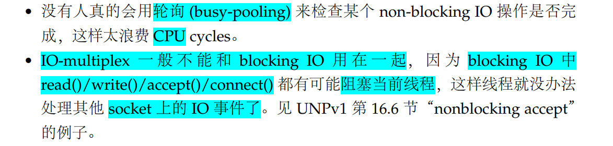
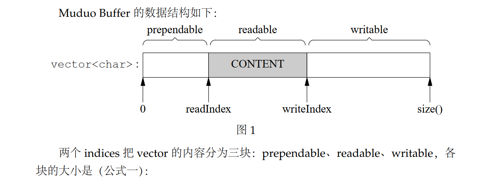
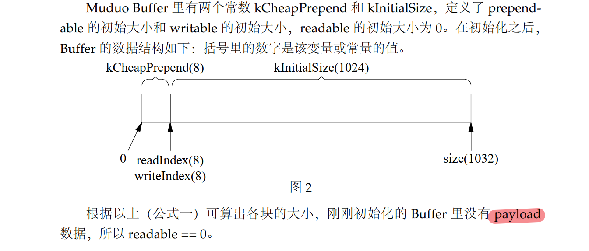
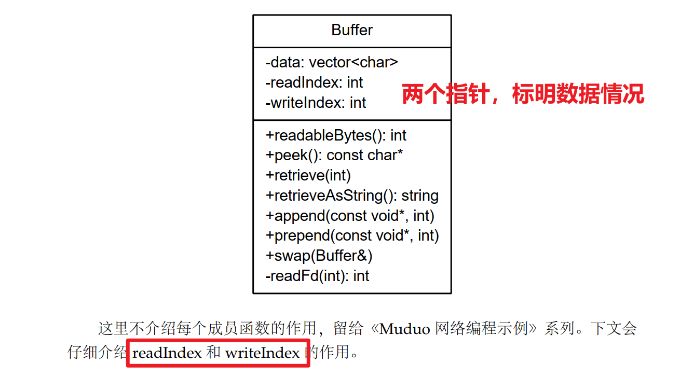
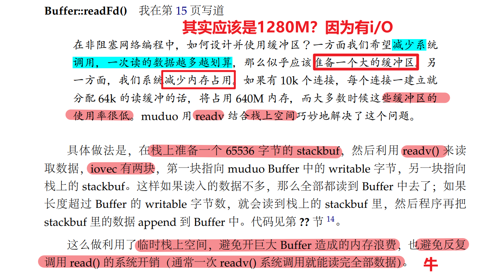
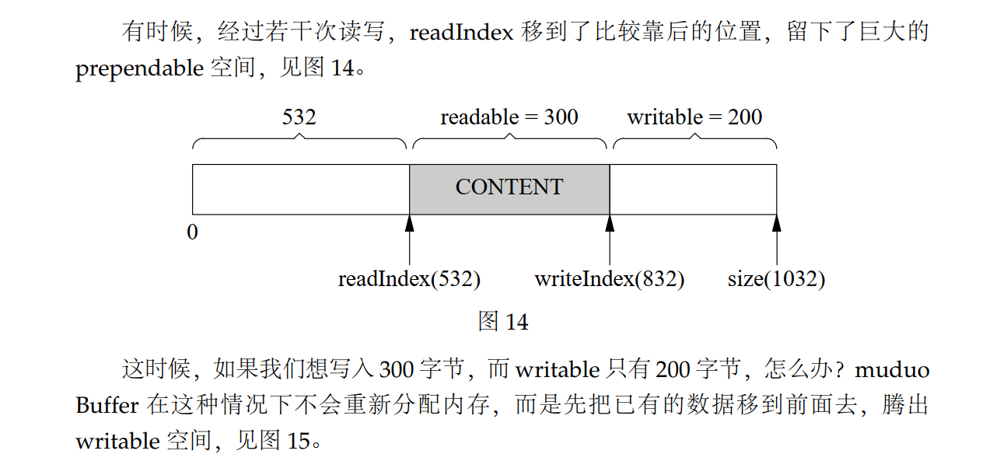

# base库

**工作描述：**

1. 实现时间戳类、原子性操作类、异常类等的封装；实现线程安全的单例模式类
2. 线程类、底层IPC类（互斥锁、条件变量、倒计时门闩）、线程本地存储ThreadLocal类的封装实现，用于支持多线程并发
3. 日志系统实现：支持不同的日志记录级别、支持日志滚动、支持**多线程写入日志文件**
   - 通过宏定义实现调用不同的构造函数Logger
   - LogFile实现后两者
4. 线程池实现：能够动态销毁线程
   - 需要添加的功能，需要知道原理。（pthread_cond_timedwait)
5. 定时器Timer实现：支持注册关注定时事件

**设计思想：**

1. RAII资源管理技术（MutexLockGuard）
2. 基于对象的编程思想（函数回调的形式）

## 日志系统实现

1. 实现日志流`LogStream.h/.cc`

   - 非类型参数模板`FixedBuffer`用于充当日志缓冲区（通过`char data_[SIZE]`)
     - append，日志记录添加
     - data：返回日志缓冲数据
     - length：返回日志长度
     - avail：返回缓冲区剩余大小
     - reset/bzero；清空缓冲区\

   - 默认日志流缓冲区大小为`kSmallBuffer`,typedef detail::FixedBuffer\<detail::kSmallBuffer\> Buffer;
   - 重载一系列输出流运算符`operator<<`

2. **普通日志系统实现：Logging.h/.cc**

   - 枚举类型定义`LogLevel`
   - 嵌套内`Impl`
     - 包含一个LogStream
     - 接受日志级别，错误类型，日志记录的源文件名、代码行
     - 日志记录时间`Timestamp`
   - 重载一些列类`Logger`的构造函数，用于不同的日志级别。并通过宏定义实现便捷使用

```c++
#define LOG_TRACE if (muduo::Logger::logLevel() <= muduo::Logger::TRACE) \
  muduo::Logger(__FILE__, __LINE__, muduo::Logger::TRACE, __func__).stream()
#define LOG_DEBUG if (muduo::Logger::logLevel() <= muduo::Logger::DEBUG) \
  muduo::Logger(__FILE__, __LINE__, muduo::Logger::DEBUG, __func__).stream()
#define LOG_INFO if (muduo::Logger::logLevel() <= muduo::Logger::INFO) \
  muduo::Logger(__FILE__, __LINE__).stream()
#define LOG_WARN muduo::Logger(__FILE__, __LINE__, muduo::Logger::WARN).stream()
#define LOG_ERROR muduo::Logger(__FILE__, __LINE__, muduo::Logger::ERROR).stream()
#define LOG_FATAL muduo::Logger(__FILE__, __LINE__, muduo::Logger::FATAL).stream()
#define LOG_SYSERR muduo::Logger(__FILE__, __LINE__, false).stream()
#define LOG_SYSFATAL muduo::Logger(__FILE__, __LINE__, true).stream()

// 构造一个临时的Logger对象，
// 1. 在构造的时候，构造impl_，记录当前时间，线程ID，日志级别，错误、
// 2. 并且.stream()调用impl_.stream_; // 返回一个LogStream对象
// 3. Logstream重载了operator<<，支持如下形式
LOG_TRACE << "trace";
LOG_DEBUG << "debug";
LOG_INFO << "Hello";
LOG_WARN << "World";
LOG_ERROR << "Error";
LOG_INFO << sizeof(muduo::Logger);
LOG_INFO << sizeof(muduo::LogStream);
LOG_INFO << sizeof(muduo::Fmt);
LOG_INFO << sizeof(muduo::LogStream::Buffer);

// 当该行运行结束，临时对象Logger析构，会调用
Logger::~Logger() // 析构的时候
{
  impl_.finish(); // 添加当前的文件名，代码行
  const LogStream::Buffer& buf(stream().buffer()); // 获取日志流缓冲
  g_output(buf.data(), buf.length()); // 根据不同的输出风格打印输出
  if (impl_.level_ == FATAL)
  {
    g_flush();
    abort();
  }
}

void defaultOutput(const char* msg, int len)
{
  size_t n = fwrite(msg, 1, len, stdout);
  //FIXME check n
  (void)n;
}

void defaultFlush()
{
  fflush(stdout);
}

Logger::OutputFunc g_output = defaultOutput;
Logger::FlushFunc g_flush = defaultFlush;

// 输出函数指针
typedef void (*OutputFunc)(const char* msg, int len);
typedef void (*FlushFunc)();
void Logger::setOutput(OutputFunc out)
{
  g_output = out;
}
```

3. **专门的日志记录文件实现**`LogFile.h/.cc`

   - 能够实现日志滚动

     - 每隔一天滚动一次
     - 超过1024条记录，检测是否滚动

   - 辅助嵌套类`File`实现：

     - 根据传入的文件名，以追加的方式打开
     - append：写入日志信息
     - flush：刷新日志文件

   - 构造函数`LogFile`，获取日志文件的base_name，滚动的大小rollSize，线程锁等

     - 传入的baseName不能有/

     - 构造函数体中，通过rollFile创建第一个日志记录文件，日志记录文件名由`getLogFileName`生成

       **文件名包含：**basename + 时间戳 + 主机名 + 处理器进程ID + 后缀`.log`

   - 通过append函数，向当前file_写入日志记录信息

     ```c++
     void LogFile::append(const char* logline, int len)
     {
       if (mutex_)
       {
         MutexLockGuard lock(*mutex_);
         append_unlocked(logline, len);
       }
       else
       {
         append_unlocked(logline, len);
       }
     }
     // 具体的业务逻辑实现
     void LogFile::append_unlocked(const char* logline, int len)
     {
       file_->append(logline, len);
     
       if (file_->writtenBytes() > rollSize_)
       {
         rollFile();
       }
       else
       {
         if (count_ > kCheckTimeRoll_)
         {
           count_ = 0;
           time_t now = ::time(NULL);
           time_t thisPeriod_ = now / kRollPerSeconds_ * kRollPerSeconds_;
           if (thisPeriod_ != startOfPeriod_)
           {
             rollFile();
           }
           else if (now - lastFlush_ > flushInterval_)
           {
             lastFlush_ = now;
             file_->flush();
           }
         }
         else
         {
           ++count_;
         }
       }
     }
     ```

   **LogFile测试代码：**

   ```c
   #include <muduo/base/LogFile.h>
   #include <muduo/base/Logging.h>
   
   boost::scoped_ptr<muduo::LogFile> g_logFile;
   
   void outputFunc(const char* msg, int len)
   {
     g_logFile->append(msg, len);
   }
   
   void flushFunc()
   {
     g_logFile->flush();
   }
   
   int main(int argc, char* argv[])
   {
     char name[256];
     strncpy(name, argv[0], 256);
     g_logFile.reset(new muduo::LogFile(::basename(name), 200*1000));
     muduo::Logger::setOutput(outputFunc);
     muduo::Logger::setFlush(flushFunc);
   
     muduo::string line = "1234567890 abcdefghijklmnopqrstuvwxyz ABCDEFGHIJKLMNOPQRSTUVWXYZ ";
   
     for (int i = 0; i < 10000; ++i)
     {
       LOG_INFO << line << i;
   
       usleep(1000);
     }
   }

4. **异步日志`AsyncLogging.h/.cc`实现：**

   - 通过设计多个前端生产者线程，和一个后端线程写入日志。后端线程是由`AsyncLogging`构造的

   - **数据成员**

   ```c
   // 供后端消费者线程调用（将数据写到日志文件）
   void threadFunc();
   
   typedef muduo::detail::FixedBuffer<muduo::detail::kLargeBuffer> Buffer;
   typedef boost::ptr_vector<Buffer> BufferVector; 
   // 一个缓冲队列。用ptr_vector自动管理对象生命周期
   typedef BufferVector::auto_type BufferPtr; // 可理解为Buffer的智能指针，能管理Buffer的生存期
   // 类似于C++11中的unique_ptr，具有移动语义
   // 两个unique_ptr不能指向同一个对象，不能进行复制操作
   
   const int flushInterval_; // 超时时间，在flushInterval_秒内，缓冲区没写满，仍将缓冲区中的数据写到文件
   bool running_; // 是否启动日志线程
   string basename_; // 日志记录的名字.log
   size_t rollSize_; // 日志滚动的大小限制
   muduo::Thread thread_; // 后端线程
   muduo::CountDownLatch latch_;  // 用于等待线程启动
   muduo::MutexLock mutex_; // 用于前端生产者线程同步
   muduo::Condition cond_; 
   BufferPtr currentBuffer_; // 当前缓冲区
   BufferPtr nextBuffer_;    // 预备缓冲区
   BufferVector buffers_;    // 待写入文件的已填满的缓冲区
   ```

   - 构造函数：数据成员初始化工作

   ```c
   AsyncLogging::AsyncLogging(const string& basename,
                              size_t rollSize,
                              int flushInterval)
     : flushInterval_(flushInterval),
       running_(false),
       basename_(basename),
       rollSize_(rollSize),
       thread_(boost::bind(&AsyncLogging::threadFunc, this), "Logging"),
       latch_(1), /* 前端线程个数 */
       mutex_(),
       cond_(mutex_),
       currentBuffer_(new Buffer),
       nextBuffer_(new Buffer),
       buffers_()
   {
     currentBuffer_->bzero(); // 清空缓冲区内容
     nextBuffer_->bzero();
     buffers_.reserve(16);
   }

- 对外提供后端线程启动函数`start`，并且通过latch_来等待线程函数执行完毕。

  - 在threadFunc中，while (running_)循环写日志文件。
  - 当stop的时候，running_为false，日志线程停止写。条件变量cond\_通知阻塞的后端线程。跳出while
  - 并且join等待后端线程结束

  ```c
  void stop()
  {
      running_ = false;
      cond_.notify();
      thread_.join();
  }
  
  while (running_)
  {
      if (buffers_.empty())  // unusual usage!(注意：这是一个非常规用法，不能解决虚假唤醒问题)
      {
          cond_.waitForSeconds(flushInterval_); // 
      }
  }

# net库

## TcpServer的完整业务逻辑

### TcpServer的设置

**成员变量：**

```c++
typedef std::map<string, TcpConnectionPtr> ConnectionMap;

EventLoop* loop_;  // the acceptor loop
const string hostport_;		// 服务端口
const string name_;			// 服务名
boost::scoped_ptr<Acceptor> acceptor_; // avoid revealing Acceptor
boost::scoped_ptr<EventLoopThreadPool> threadPool_;
ConnectionCallback connectionCallback_;
MessageCallback messageCallback_;
WriteCompleteCallback writeCompleteCallback_;		// 数据发送完毕，会回调此函数
ThreadInitCallback threadInitCallback_;	// IO线程池中的线程在进入事件循环前，会回调用此函数
bool started_;
// always in loop thread
int nextConnId_;				// 下一个连接ID
ConnectionMap connections_;	// 连接列表
```

**成员函数**

```c++
TcpServer::TcpServer(EventLoop* loop,
                     const InetAddress& listenAddr,
                     const string& nameArg)
  : loop_(CHECK_NOTNULL(loop)),
    hostport_(listenAddr.toIpPort()),
    name_(nameArg),
    acceptor_(new Acceptor(loop, listenAddr)),
    threadPool_(new EventLoopThreadPool(loop)),
    connectionCallback_(defaultConnectionCallback),
    messageCallback_(defaultMessageCallback),
    started_(false),
    nextConnId_(1)
{
  // Acceptor::handleRead函数中会回调用TcpServer::newConnection
  // _1对应的是socket文件描述符，_2对应的是对等方的地址(InetAddress)
  acceptor_->setNewConnectionCallback(
      boost::bind(&TcpServer::newConnection, this, _1, _2));
}

// 通过构造函数，初始化server的信息:
// 1. 由acceptor那个eventloop负责担任main reactor
// 2. 服务器的地址(用于打印显示）：InetAddress的toIpPort()会调用socketsOps封装好的
void sockets::toIpPort(char* buf, size_t size,
                       const struct sockaddr_in& addr)
{
  char host[INET_ADDRSTRLEN] = "INVALID";
  toIp(host, sizeof host, addr);
  uint16_t port = sockets::networkToHost16(addr.sin_port);
  snprintf(buf, size, "%s:%u", host, port);
}

// 3. 服务器端的名字
// 4. 初始化一个acceptor用来监听连接请求，绑定到当前loop，地址为listenAddr
// 会调用，在TcpServer构造时，构造的成员变量accptor_，进而构造的acceptSocket_的listen()
Acceptor::Acceptor(EventLoop* loop, const InetAddress& listenAddr)
  : loop_(loop),
    acceptSocket_(sockets::createNonblockingOrDie()),
    acceptChannel_(loop, acceptSocket_.fd()),
    listenning_(false),
    idleFd_(::open("/dev/null", O_RDONLY | O_CLOEXEC))
{
  assert(idleFd_ >= 0);
  acceptSocket_.setReuseAddr(true);
  acceptSocket_.bindAddress(listenAddr); // 绑定地址
  acceptChannel_.setReadCallback(
      boost::bind(&Acceptor::handleRead, this));
} 
// 在这里已经设置了当前acceptor套接字acceptSocket_的一些属性setReuseAddr
// 设置了有连接到来的事件处理函数
void Acceptor::handleRead()
{
  loop_->assertInLoopThread();
  InetAddress peerAddr(0);
  //FIXME loop until no more
  int connfd = acceptSocket_.accept(&peerAddr);
  if (connfd >= 0) // 成功返回
  {
    // string hostport = peerAddr.toIpPort();
    // LOG_TRACE << "Accepts of " << hostport;
    if (newConnectionCallback_)
    {
      newConnectionCallback_(connfd, peerAddr); 
        // 如果注册了相应的事件处理函数，就回调
		// ----->通过如下函数注册 
        // void setNewConnectionCallback(const NewConnectionCallback& cb)
        // 在TcpServer构造函数{}中注册，注册为TcpServer::newConnection
        // 目的在于，当连接到来的时候，应该回调TcpServer提供的newConnection处理业务
    }
    else
    {
      sockets::close(connfd);
    }
  }
  else 
  {
    // Read the section named "The special problem of
    // accept()ing when you can't" in libev's doc.
    // By Marc Lehmann, author of livev.
    if (errno == EMFILE)
    {
      ::close(idleFd_);
      idleFd_ = ::accept(acceptSocket_.fd(), NULL, NULL);
      ::close(idleFd_);
      idleFd_ = ::open("/dev/null", O_RDONLY | O_CLOEXEC);
    }
  }
}

// Acceptor在handleRead的时候，处理的实际业务逻辑
void TcpServer::newConnection(int sockfd, const InetAddress& peerAddr)
{
  loop_->assertInLoopThread();
  char buf[32];
  snprintf(buf, sizeof buf, ":%s#%d", hostport_.c_str(), nextConnId_);
  ++nextConnId_;
  string connName = name_ + buf; // 生成新链接的名字
    
  InetAddress localAddr(sockets::getLocalAddr(sockfd)); // 生成本地地址
  // FIXME poll with zero timeout to double confirm the new connection
  // FIXME use make_shared if necessary
  TcpConnectionPtr conn(new TcpConnection(loop_,
                                          connName,
                                          sockfd,
                                          localAddr,
                                          peerAddr));  
    // 为当前连接创建一个TcpConnectionPtr来管理
  connections_[connName] = conn;
    // TcpConnectionPtr的回调函数注册
  conn->setConnectionCallback(connectionCallback_); // 连接响应函数，由用户提供
  conn->setMessageCallback(messageCallback_); // 消息到来响应函数，由用户提供
  conn->setCloseCallback(
      boost::bind(&TcpServer::removeConnection, this, _1));
  conn->connectEstablished(); 
    // 调用connectEstablished，更改相应的连接状态，并且channel加入到poller监听
}
-------------------------------/*connectEstablished()*/---------------------
void TcpConnection::connectEstablished()
{
  loop_->assertInLoopThread();
  assert(state_ == kConnecting);
  setState(kConnected);
  channel_->tie(shared_from_this()); // shared_from_this临时shared_ptr对象
  channel_->enableReading();	// TcpConnection所对应的通道加入到Poller关注

  connectionCallback_(shared_from_this());
}

// 紧接着，初始化一个IO线程池，默认大小为0，可以通过server_.setThreadNum设定
// 初始化连接到来、消息到来，消息发送完毕的回调函数
```

**在初始化成功tcpserver之后，会调用start函数**

```c++
// 该函数多次调用是无害的
// 该函数可以跨线程调用
void TcpServer::start()
{
  if (!started_)
  {
    started_ = true;
    threadPool_->start(threadInitCallback_); // 线程池启动，
  }

  if (!acceptor_->listenning())
  {
	// get_pointer返回原生指针
    loop_->runInLoop(
        boost::bind(&Acceptor::listen, get_pointer(acceptor_)));
  }
}

// 线程池启动工作
void EventLoopThreadPool::start(const ThreadInitCallback& cb)
{
  assert(!started_);
  baseLoop_->assertInLoopThread();

  started_ = true;
 // 初始化numThreads_数目的IO线程，并且会执行EventLoopThread::startLoop()
  for (int i = 0; i < numThreads_; ++i)
  {
    EventLoopThread* t = new EventLoopThread(cb);
    threads_.push_back(t);
    loops_.push_back(t->startLoop());	// 启动EventLoopThread线程，在进入事件循环之前，会调用cb
  }
  if (numThreads_ == 0 && cb)
  {
    // 只有一个EventLoop，在这个EventLoop进入事件循环之前，调用cb
    cb(baseLoop_);
  }
}

// EventLoop::startLoop
EventLoop* EventLoopThread::startLoop()
{
  assert(!thread_.started());
  thread_.start();

  {
    MutexLockGuard lock(mutex_);
    while (loop_ == NULL)
    {
      cond_.wait();  
        // 会在这里等待县城入口函数执行完毕（即等待线程入口函数创建一个loop对象
    }
  }

  return loop_;
}

// Acceptor::listen所做工作：
// 将服务器启动状态started_标记为true
// 将拥有的acceptor对象启动监听。通过向loop添加事件runInLoop()注册
--------------------------------------------------------------------------
void Acceptor::listen()
{
  loop_->assertInLoopThread();
  listenning_ = true; 
  acceptSocket_.listen(); 
    // 套接字启动监听：调用了sockets::listenOrDie(sockfd_);
  acceptChannel_.enableReading(); // 将监听通道纳入poller管理
    // 这里的纳入管理，是通过enableReading调用update实现
}
```

**loop如何开始业务逻辑处理？**

> 在前面，我们将`Acceptor::listen`添加到loop的functors等待执行。可是何时运行呢？

```c++
// 在I/O线程中执行某个回调函数，该函数可以跨线程调用
void EventLoop::runInLoop(const Functor& cb)
{
  if (isInLoopThread())
  {
    // 如果是当前IO线程调用runInLoop，则同步调用cb
    cb();
  }
  else
  {
    // 如果是其它线程调用runInLoop，则异步地将cb添加到队列
    queueInLoop(cb);
  }
}

// 如果是跨线程调用，则当前任务不会立即执行
// 而是添加到Loop的pendingFunctors_等待执行。
void EventLoop::queueInLoop(const Functor& cb)
{
  {
  MutexLockGuard lock(mutex_);
  pendingFunctors_.push_back(cb);
  }

  // 调用queueInLoop的线程不是IO线程需要唤醒
  // 或者调用queueInLoop的线程是IO线程，并且此时正在调用pending functor，需要唤醒
  // 只有IO线程的事件回调中调用queueInLoop才不需要唤醒
  if (!isInLoopThread() || callingPendingFunctors_)
  {
      // 如果不在当前IO线程，或者正在执行添加的一系列Functor、需要唤醒
    wakeup();
  }
}
// 如果不进行唤醒，就可能会产生饥饿
void EventLoop::wakeup()
{
  uint64_t one = 1;
  //ssize_t n = sockets::write(wakeupFd_, &one, sizeof one);
  ssize_t n = ::write(wakeupFd_, &one, sizeof one);
  if (n != sizeof one)
  {
    LOG_ERROR << "EventLoop::wakeup() writes " << n << " bytes instead of 8";
  }
}

// 唤醒之后，eventLoop的loop就会有返回，即poller_->poll会返回。
// 然后顺序执行监听的activechannels相应事件
// 然后doPendingFunctors();
void EventLoop::doPendingFunctors()
{
  std::vector<Functor> functors;
  callingPendingFunctors_ = true;

  {
  MutexLockGuard lock(mutex_);
  functors.swap(pendingFunctors_);
  }

  for (size_t i = 0; i < functors.size(); ++i)
  {
    functors[i]();
  }
  callingPendingFunctors_ = false;
}
```

> 可以看到，我们如果是跨线程调用了`TcpServer的start`，并且当前`TcpServer`的事件循环没有开启。我们没有办法wakeup的。因为无法启动监听。
>
> 这也是为什么，我们测试样例会有一个`loop.loop()`工作

### TcpServer的事件响应流程

1. 当有新的连接到来的时候

   - 首先，底层的poller返回的activeChannels里面，会有`Acceptor`的通道`  Channel acceptChannel_;`
   - 进而会调用我们初始化`Acceptor`时，绑定的`Acceptor::handleRead()`

2. 在处理新的连接请求的时候，会调用`  int connfd = acceptSocket_.accept(&peerAddr);`来接收该连接。

   - 如果`connfd>= 0`，表明接收成功。此时，如果我们需要对这个成功的连接进行一些业务逻辑处理。就需要在初始化`Acceptor`的时候设置`newConnectionCallback_`

     > 这一步是在，TcpServer构造函数中实现的

     ```c++
     void TcpServer::newConnection(int sockfd, const InetAddress& peerAddr)
     {
       loop_->assertInLoopThread();
       // 按照轮叫的方式选择一个EventLoop
       EventLoop* ioLoop = threadPool_->getNextLoop();
       char buf[32];
       snprintf(buf, sizeof buf, ":%s#%d", hostport_.c_str(), nextConnId_);
       ++nextConnId_;
       string connName = name_ + buf;
     
       InetAddress localAddr(sockets::getLocalAddr(sockfd));
       TcpConnectionPtr conn(new TcpConnection(ioLoop,
                                               connName,
                                               sockfd,
                                               localAddr,
                                               peerAddr));
     
       connections_[connName] = conn;
         // 将tcp的回调函数注册为TcpServer的成员变量
       conn->setConnectionCallback(connectionCallback_);
       conn->setMessageCallback(messageCallback_);
       conn->setWriteCompleteCallback(writeCompleteCallback_);
     
       conn->setCloseCallback(
           boost::bind(&TcpServer::removeConnection, this, _1));
         // 这里的轮叫，是跨线程调用，所以应该runInLoop的形式
       ioLoop->runInLoop(boost::bind(&TcpConnection::connectEstablished, conn));
     
     }
     ```

   - 如果没有设置新连接处理函数，我们直接`sockets::close(connfd)`-

   - 如果`connfd<0`，说明出错

     - 如果错误为`EMFILE`，表明当前连接数达到上限，因此需要处理

       ```c
       if (errno == EMFILE)
       {
           ::close(idleFd_);
           idleFd_ = ::accept(acceptSocket_.fd(), NULL, NULL);
           ::close(idleFd_);
           idleFd_ = ::open("/dev/null", O_RDONLY | O_CLOEXEC);
       }

     - 其他错误，就忽略？

3. 通常情况下，我们对于新的连接，需要在TcpServer中进行管理。即将这个连接，用一个`TcpConnectionPtr`智能指针对象来管理。

   - 对该新连接进行初始化
     - conneName
     - 所属的eventloop
     - 文件描述符
     - 对等端地址
     
     - tcp通道回调函数注册（用于已连接套接字的业务逻辑处理）

   ```c++
   TcpConnection::TcpConnection(EventLoop* loop,
                                const string& nameArg,
                                int sockfd,
                                const InetAddress& localAddr,
                                const InetAddress& peerAddr)
     : loop_(CHECK_NOTNULL(loop)),
       name_(nameArg),
       state_(kConnecting),
       socket_(new Socket(sockfd)),
       channel_(new Channel(loop, sockfd)),
       localAddr_(localAddr),
       peerAddr_(peerAddr),
       highWaterMark_(64*1024*1024)
   {
     // 通道可读事件到来的时候，回调TcpConnection::handleRead，_1是事件发生时间
     channel_->setReadCallback(
         boost::bind(&TcpConnection::handleRead, this, _1));
     // 通道可写事件到来的时候，回调TcpConnection::handleWrite
     channel_->setWriteCallback(
         boost::bind(&TcpConnection::handleWrite, this));
     // 连接关闭，回调TcpConnection::handleClose
     channel_->setCloseCallback(
         boost::bind(&TcpConnection::handleClose, this));
     // 发生错误，回调TcpConnection::handleError
     channel_->setErrorCallback(
         boost::bind(&TcpConnection::handleError, this));
     LOG_DEBUG << "TcpConnection::ctor[" <<  name_ << "] at " << this
               << " fd=" << sockfd;
     socket_->setKeepAlive(true);
   }
   ```

   - 注册的回调函数`connectionCallback_,messageCallback_ `，是由TcpServer的成员函数提供。

     > 这些回调函数，又是通过包含`TcpServer`的具体`Server`类在构造函数中提供。

   - 跨线程调用`TcpConnection::connectEstablished()`，将该套接字对应的channel注册（通过enableReading)

     ```c++
     void TcpConnection::connectEstablished()
     {
       loop_->assertInLoopThread();
       assert(state_ == kConnecting);
       setState(kConnected);
       channel_->tie(shared_from_this()); // shared_from_this临时shared_ptr对象
       // void tie(const std::shared_ptr<void>&);
       channel_->enableReading();	// TcpConnection所对应的通道加入到Poller关注
       connectionCallback_(shared_from_this());
     }
     ```

4. 对于每一个`TcpConnection`对象，它都拥有

   - 一个智能指针管理的`Socket`(主要是文件描述符)
   - 一个智能指针管理的`Channel`，用于事件响应

5. 当poller返回活跃通道之后，EventLoop会遍历执行channel的`handleEvent`函数

   ```c++
   void Channel::handleEvent(Timestamp receiveTime)
   {
     boost::shared_ptr<void> guard;
       // 根据当前是否绑定，在TcpConnetion::connectEstablished中绑定
       // 目的在于：防止在tcpServer中就将该channel析构，造成core dump
     if (tied_)
     {
       guard = tie_.lock();
       if (guard)
       {
         LOG_TRACE << "[6] usecount=" << guard.use_count();
         handleEventWithGuard(receiveTime);
   	  LOG_TRACE << "[12] usecount=" << guard.use_count();
       }
     }
     else
     {
       handleEventWithGuard(receiveTime);
     }
   }
   
   // 具体业务逻辑就是由：handleEventWithGuard执行
   void Channel::handleEventWithGuard(Timestamp receiveTime)
   {
     eventHandling_ = true;
     if ((revents_ & POLLHUP) && !(revents_ & POLLIN)) 
     {
       if (logHup_)
       {
         LOG_WARN << "Channel::handle_event() POLLHUP";
       }
       if (closeCallback_) closeCallback_(); // TcpConnection::handleClose
     }
   
     if (revents_ & POLLNVAL)
     {
       LOG_WARN << "Channel::handle_event() POLLNVAL";
     }
   
     if (revents_ & (POLLERR | POLLNVAL))
     {
       if (errorCallback_) errorCallback_(); // TcpConnection::handleError
     }
     if (revents_ & (POLLIN | POLLPRI | POLLRDHUP))
     {
       if (readCallback_) readCallback_(receiveTime);   
         // TcpConnection::handleRead
     }
     if (revents_ & POLLOUT)
     {
       if (writeCallback_) writeCallback_(); // TcpConnection::handleWrite
     }
     eventHandling_ = false;
   }
   
   // 根据具体的POLL事件类型，执行不同的业务。由TcpConnection提供的回调函数
   // 在具体的handleClose，handleWrite等中，其实又涉及到TcpConnection接收注册的
   //  ConnectionCallback connectionCallback_;
   //  MessageCallback messageCallback_;
   // 由TcpServer的newConnection提供。这又有外部提供。
   // POLLIN和POLLHUP事件：发生在client端read为0，调用close
   ```

6. 进而，调用channel的相应的处理函数

### TcpConnection的数据发送和接收

**因为TCP是面向连接的字节流协议，因此，存在着粘包，数据消息不完整的情况。**

为了避免IO线程阻塞在数据收发的逻辑上，因此需要提供应用层缓冲区，buffer。

1. 当要发送数据的时候，直接调用`send`发送数据(可以跨线程调用)

2. 如果是跨线程调用，则`runInLoop`添加`sendInLoop`
3. 当`sendInLoop`发送完毕，如果注册了`消息发送完毕`事件，那么需要通知应用层继续发送数据`writeCompleteCallback`
4. 如果没有发送完毕，则添加关注`POLLOUT`事件。
5. 之后就是`handleWrite`继续处理应用层数据发送事件。当发送完毕，调用writeCompleteCallback，并且取消关注`POLLOUT`事件

### TcpConnection的连接断开与shutdownWrite

1. 当应用层调用shutdown的时候，会将当前连接状态置为kDisconnecting
2. 并且，在loop中添加一个任务shutdownInLoop
3. 如果此时没有消息需要发送，（此时不会关注POLLOUT）
4. 那么就直接调用sockets::shutdownWrite()
5. 如果此时，处于消息发送状态，那么，会持续关注POLLOUT
6. 并且当内核缓冲区可写，即handleWrite处理业务逻辑的时候。
7. 当`outputBuffer_.readableBytes() == 0`的时候，会通知上层应用程序，`writeCompleteCallback_`

```c++
if (state_ == kDisconnecting)                                
{                                                            
   shutdownInLoop(); // 关闭write端                         
}                                                                             
```

**也许会认为，writeCompleteCallback_回调里面也有send，会继续填充outputBuffer\_?**
**答案：不会，因为send的时候，会判断state_ == kConnected**

```c++
// 线程安全，可以跨线程调用
void TcpConnection::send(const StringPiece& message)
{
  if (state_ == kConnected)
  {
    if (loop_->isInLoopThread())
    {
      sendInLoop(message);
    }
    else
    {
      loop_->runInLoop(
          boost::bind(&TcpConnection::sendInLoop,
                      this,
                      message.as_string()));
                    //std::forward<string>(message)));
    }
  }
}
```

### chargen测试代码实现

```c++
#include <muduo/net/TcpServer.h>
#include <muduo/net/EventLoop.h>
#include <muduo/net/InetAddress.h>

#include <boost/bind.hpp>

#include <stdio.h>

using namespace muduo;
using namespace muduo::net;

class TestServer
{
 public:
  TestServer(EventLoop* loop,
             const InetAddress& listenAddr)
    : loop_(loop),
      server_(loop, listenAddr, "TestServer")
  {
     // 为TcpServer注册回调函数，用于TcpConnection
    server_.setConnectionCallback(
        boost::bind(&TestServer::onConnection, this, _1));
    server_.setMessageCallback(
        boost::bind(&TestServer::onMessage, this, _1, _2, _3));
	server_.setWriteCompleteCallback(
      boost::bind(&TestServer::onWriteComplete, this, _1));

    string line;
    for (int i = 33; i < 127; ++i)
    {
      line.push_back(char(i));
    }
    line += line;

    for (size_t i = 0; i < 127-33; ++i)
    {
      message_ += line.substr(i, 72) + '\n';
    }
  }

  void start()
  {
	  server_.start();
  }

 private:
  void onConnection(const TcpConnectionPtr& conn)
  {
    if (conn->connected())
    {
      printf("onConnection(): new connection [%s] from %s\n",
             conn->name().c_str(),
             conn->peerAddress().toIpPort().c_str());

      conn->setTcpNoDelay(true);
      conn->send(message_);
    }
    else
    {
      printf("onConnection(): connection [%s] is down\n",
             conn->name().c_str());
    }
  }

  void onMessage(const TcpConnectionPtr& conn,
                 Buffer* buf,
                 Timestamp receiveTime)
  {
    muduo::string msg(buf->retrieveAllAsString());
	printf("onMessage(): received %zd bytes from connection [%s] at %s\n",
           msg.size(),
           conn->name().c_str(),
           receiveTime.toFormattedString().c_str());

    conn->send(msg);
  }

  void onWriteComplete(const TcpConnectionPtr& conn)
  {
    conn->send(message_);
  }

  EventLoop* loop_;
  TcpServer server_;

  muduo::string message_;
};


int main()
{
  printf("main(): pid = %d\n", getpid());

  InetAddress listenAddr(8888);
  EventLoop loop;

  TestServer server(&loop, listenAddr);
  server.start();

  loop.loop();
}
```

## Buffer的设计

**首先，我们采用的是one loop per thread,基于EventLoop的reactor模式。**

non-blocking网络编程需要借助**IO复用**实现



**非阻塞网络编程的核心思想**

- IO复用
- 应用层缓冲区
- **核心思想在于：**避免阻塞在read/write或者其他IO复用上。尽可能地让当前线程阻塞在IO复用函数上`select/poll/epoll_wait`等

### 为什么需要应用层缓冲区buffer

1. 对于TcpConnection，必须要有output buffer（为了让程序不阻塞在write的系统调用上，高流量场景）

2. TcpConnection必须要有input buffer：

   > 从协议的角度出发，**tcp是一个无边界的字节流协议，因此接收方需要处理两种情况**
   >
   > - 收到的数据尚不构成一条完整的消息。这时候需要将收到的数据，先放到input buffer，等构成一条完整的消息再通知程序的业务逻辑。`codec设计实现`
   > - 一次收到两条消息的数据
   >
   > 而我们又是采用的`epoll的LT模式`，因此，当socket可读事件到来的时候，我们应该尽可能地将内核缓冲区的数据取走。否则会重复触发POLLIN事件。造成`busy-loop`。

### 设计的要求

**数据结构：**

- vector of char

- 两个int数据成员，充当指针。并且能够避免**迭代器失效**问题。

  > 由于vector重新分配了内存，原来指向它的元素的指针会失效。这就是为什么是整数下标而不是指针

- 两个常数kCheapPrepend和kInitialSize





**特点：**

- 连续的内存空间
- 可以**自动增长**长度，适应不同大小的消息。

**类图和接口实现：**



**创新思想：**

> 如果给每个TcpConnection都预留很大的空间，那么在高并发场景下，可能会占用过多的内存。
>
> **解决办法：readFd()**



```c++
ssize_t Buffer::readFd(int fd, int* savedErrno)

{
  // saved an ioctl()/FIONREAD call to tell how much to read
  // 节省一次ioctl系统调用（获取有多少可读数据）
  char extrabuf[65536];
  struct iovec vec[2];
  const size_t writable = writableBytes();
  // 第一块缓冲区
  vec[0].iov_base = begin()+writerIndex_;
  vec[0].iov_len = writable;
  // 第二块缓冲区
  vec[1].iov_base = extrabuf;
  vec[1].iov_len = sizeof extrabuf;
  const ssize_t n = sockets::readv(fd, vec, 2);
  if (n < 0)
  { 
    *savedErrno = errno;
  }
  else if (implicit_cast<size_t>(n) <= writable)	//第一块缓冲区足够容纳
  {
    writerIndex_ += n;
  }
  else		// 当前缓冲区，不够容纳，因而数据被接收到了第二块缓冲区extrabuf，将其append至buffer
  {
    writerIndex_ = buffer_.size();
    append(extrabuf, n - writable);
  }
  return n;
}
// readv的底层实现
ssize_t readv(int fd, const struct iovec *iov, int iovcnt);
```

**readv的底层实现：**

```c++
#include <sys/uio.h>

ssize_t readv(int fd, const struct iovec *iov, int iovcnt);
ssize_t writev(int fd, const struct iovec *iov, int iovcnt);
ssize_t preadv(int fd, const struct iovec *iov, int iovcnt,
               off_t offset);
ssize_t pwritev(int fd, const struct iovec *iov, int iovcnt,
                off_t offset);
// The pointer iov points to an array of iovec structures, defined in <sys/uio.h> as:
struct iovec {
    void  *iov_base;    /* Starting address */
    size_t iov_len;     /* Number of bytes to transfer */
};
```

> 从文件描述符fd中，读取数据到`iov`缓冲区。
>
> -  The readv() system call works just like read(2) except that **multiple buffers are filled.**
> - The writev() system call works just like write(2) except that multiple buffers are written out.
>
> **readv在从fd中读取数据的时候，会按次序填充到缓冲区iov。**
>
> 返回成功读取或者发送的数据长度

**内部腾挪：**



**prepend的优势：**

> 让程序以很低的代价在数据前面添加几个字节。
>
> **空间换时间的思路**

**零拷贝：**实现分段连续的`zero copy buffer`，不要求数据在内存中连续，而是用链表把数据块链接到一起

- 代码逻辑复杂
- buffer不再是连续的，parse消息会比较麻烦
- 只有将程序做到kernel里，才能实现真正的零拷贝。否则，核心态和用户态之间始终有一次内存拷贝。

**muduo的设计目标是：用于开发公司内部的分布式程序**


## EventLoop的实现

### poller设计

1. 使用epoll的LT模式的原因

   

2. 因为ET模式不一定就比LT模式效率更高

   - 业务逻辑复杂
   - 比LT模式要多几次系统调用，迟延比较低。
   - 主流的网络库，libevent，boost的asio都是用LT模式

# muduo测试

## chargen测试


## 压力测试：filetransfer

**文件传输服务器设置：**

```c++
#include <tmuduo/base/Logging.h>
#include <tmuduo/net/EventLoop.h>
#include <muduo/net/TcpServer.h>

#include <boost/shared_ptr.hpp>

#include <stdio.h>

using namespace muduo;
using namespace muduo::net;

void onHighWaterMark(const TcpConnectionPtr& conn, size_t len)
{
  LOG_INFO << "HighWaterMark " << len;
}

const int kBufSize = 64*1024;
const char* g_file = NULL;
typedef boost::shared_ptr<FILE> FilePtr;

void onConnection(const TcpConnectionPtr& conn)
{
  LOG_INFO << "FileServer - " << conn->peerAddress().toIpPort() << " -> "
           << conn->localAddress().toIpPort() << " is "
           << (conn->connected() ? "UP" : "DOWN");
  if (conn->connected())
  {
    LOG_INFO << "FileServer - Sending file " << g_file
             << " to " << conn->peerAddress().toIpPort();
    conn->setHighWaterMarkCallback(onHighWaterMark, kBufSize+1);

    FILE* fp = ::fopen(g_file, "rb");
    if (fp)
    {
      FilePtr ctx(fp, ::fclose);
      conn->setContext(ctx);
      char buf[kBufSize];
      size_t nread = ::fread(buf, 1, sizeof buf, fp);
      conn->send(buf, nread);
    }
    else
    {
      conn->shutdown();
      LOG_INFO << "FileServer - no such file";
    }
  }
}

void onWriteComplete(const TcpConnectionPtr& conn)
{
  const FilePtr& fp = boost::any_cast<const FilePtr&>(conn->getContext());
  char buf[kBufSize];
  size_t nread = ::fread(buf, 1, sizeof buf, get_pointer(fp));
  if (nread > 0)
  {
    conn->send(buf, nread);
  }
  else
  {
    conn->shutdown();
    LOG_INFO << "FileServer - done";
  }
}

int main(int argc, char* argv[])
{
  LOG_INFO << "pid = " << getpid();
  if (argc > 1) // 传入要传输的文件名
  {
    g_file = argv[1];

    EventLoop loop;
    InetAddress listenAddr(2021); // 监听端口2021
    TcpServer server(&loop, listenAddr, "FileServer");
    server.setConnectionCallback(onConnection);
    server.setWriteCompleteCallback(onWriteComplete);
    server.start();
    loop.loop();
  }
  else
  {
    fprintf(stderr, "Usage: %s file_for_downloading\n", argv[0]);
  }
}
```


1. 吞吐量的IO测试


# 收获

## 对象生命期管理

1. 资源管理类RAII技术

2. 智能指针技术

   ```c++
   // 利用shared_ptr管理文件指针
   typedef boost::shared_ptr<FILE> FilePtr;
   FilePtr ctx(fp, ::fclose);
   // 表示ctx引用技术减为0的时候，要销毁fp是通过fclose来销毁的
   ```

   
