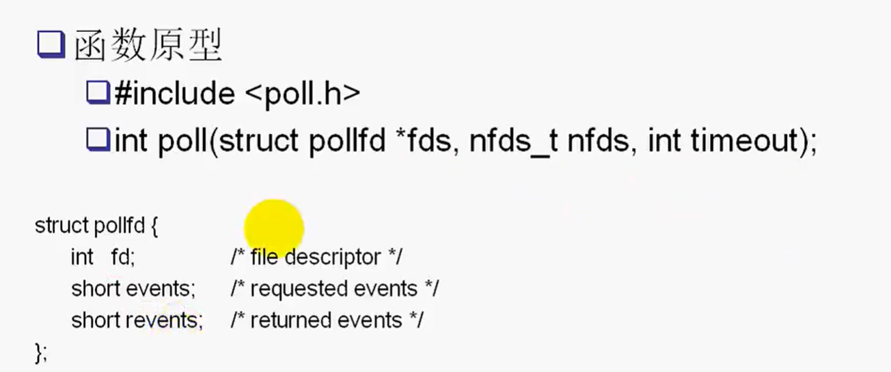
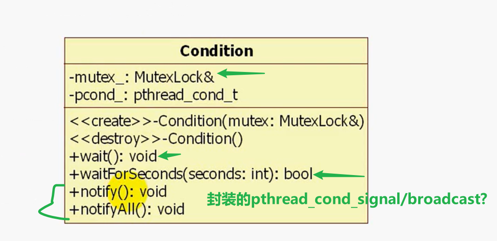
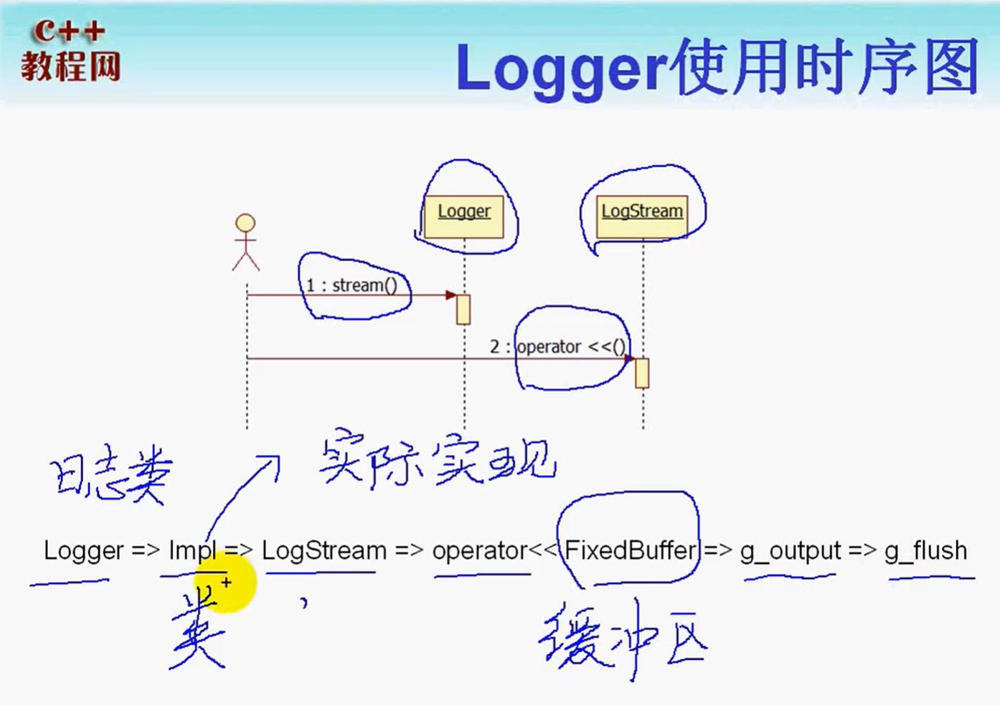
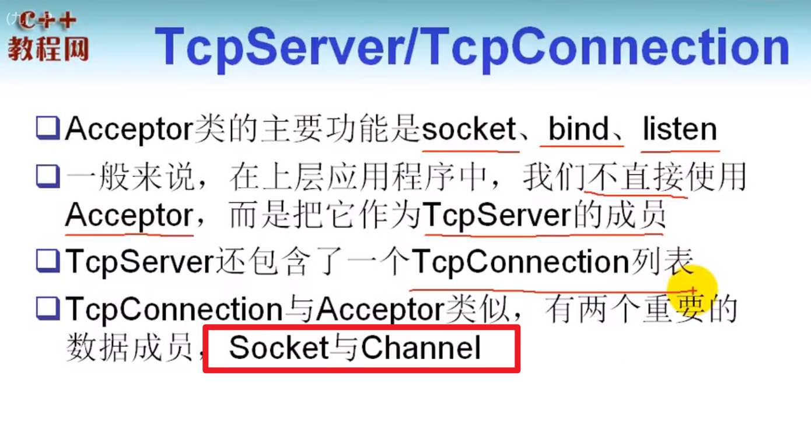

# 大并发服务器架构介绍

## 服务器的设计目标

1. **高性能**：能够处理尽可能多的并发请求、并且进行快速的响应
2. **高可用**：能够做到7x24小时服务，也能够进行故障转移（fail over）
3. **伸缩性**（scalability）:

**C/S结构：**任何网络系统都可以抽象为C/S结构

**B(rowser)/S结构：**也相当于C/S结构，只是B端时IE。浏览器相当于`HTTP客户端`，向http服务器发起HTTP请求。然后http服务器响应`http`请求

**服务器的性能杀手：**

1. **数据拷贝**：尽量减少数据拷贝（**缓存机制**）
2. **环境切换**：线程的切换开销，单线程好还是多线程好（**理性创建线程**）。单核服务器（**采用状态机编程**，效率最佳）
3. **内存分配**：**内存池**
4. **锁竞争**：锁竞争降低系统性能

**以上四点，尽可能从编程角度避免**

- 减少锁竞争范围

## 典型的服务器结构


### **服务器瓶颈：**

1. 数据库导致的瓶颈


### 从数据库层面的优化

**数据库访问层设计：**

> 用于接管数据库服务器无法响应的`应用服务器`并发请求。
>
> 提供队列服务+连接池（**线程池**？）

**超出时限（数据库响应瓶颈）的解决：**

> 通过数据库访问层，已经解决了`超出数据库连接数`带来的问题。但是对应并发请求高的情况，并发能力有限（**超时**）
>
> **解决办法：**
>
> - 尽可能的将业务逻辑挪到应用服务器。
> - 数据库服务器不应该承担过多的业务处理逻辑`占用CPU`（有限地降低数据库的压力）
> - **热点数据缓存机制：**减少对数据库的访问

**缓存机制要考虑的问题：**

1. 缓存的更新（缓存同步）

   - 缓存timeout，如果缓存失效，重新去数据库查询（实时性比较差）

   - 一旦数据库中数据更新，立即通知前端的缓存更新。实时性较高

2. 缓存占用内存空间（因此需要维护一定大小的缓存页）
   - 缓存换页：将不活跃的数据换出内存
     - FIFO
     - LRU（least recently used，最近最少使用）
     - LFU（least frequently used，最不频繁使用）

**NoSQL：**用于存放一些非关系数据，基于`key/value`存储的数据

- redis（分布式缓存）
- memcached

#### 数据库读写分离

通常情况下，数据的读操作大于写操作。对数据进行负载均衡。`replication`机制

**将数据库分为master/slave**

- 同时实现负载均衡
- master：负责数据库的写操作
- slave：负责数据库的读操作

#### 对数据库进行分库、分表

在并发请求比较大的时候，会存在`锁竞争`

1. 分库：数据库可以按照一定的逻辑，把表分散到不同的数据库（**垂直分区**）

   

2. 分表：**水平分区**，每个数据库都有数据表，只是数据的记录被切分到不同的数据库。

   

   > **数据库访问层编写难度增加**

### 从应用服务器层面优化（负载均衡）

理论上，一个应用服务器能够处理多个应用的业务请求。

当前端有大量应用请求到来的时候。负载均衡的做法

1. 任务服务器：**应用服务器被动接受任务方案**

2. 应用服务器主动到任务服务器接收任务、进行处理（**最科学**）

   > 好处：如果由任务服务器主动推送任务的模式，任务服务器可能无法做到公平调度
   >
   > **缺点：**任务服务器设计更为复杂

**任务服务器的作用：**

1. 相当于一个**HTTP客户端**，可以**查询、监视**应用服务器当前的负载
   - CPU高
   - IO高
   - 并发高
   - 内存换页高
2. 查询到这些信息之后，选取**负载最低的服务器**分配任务

 **任务服务器应该：**

1. 能够故障转移（心跳实现）**高可用要求**

## 大型网站架构演变过程

1. webserver和数据库分离

   - 不满足高可用

2. web动静资源分离

3. 前端、后端、数据库缓存处理

4. webserver集群+数据库读写分离

5. 分布式缓存

6. 分库分表

7. 多数据中心+分布式存储与计算

   > 目前大型网站对于**一致性**要求不是很高，对于这类数据没有必要保存在**关系型数据库**中
   >
   > **关系型数据库的**
   >
   > - 事务处理
   > - 大表连接join
   > - 锁竞争（事务的隔离级别影响`serialization`）
   >
   > 都是数据库服务器的性能杀手

   **因此，可以通过多数据中心，以`nosql`实现更大的并发**

   

### webserver和数据库分离


### web动静资源分离

**web请求的分类**

1. 动态请求：jsp, php
2. 静态请求：html, js, css, img


### 缓存处理


### webserver集群+读写分离（负载均衡）


## 分布式

### 分布式缓存机制redis

redis的作用

1. 为什么需要缓存？
2. 为什么需要分布式缓存？

- **缓存的优势：减少对数据库的访问**

- **分布式的优势：各个应用服务器都能够访问**

### 负载均衡


### 分布式存储


**分布式文件系统的优势：**

1. nosql是基于`key/value`存储的数据库
2. 可以建立在分布式文件系统之上
   - 减轻对IO的访问
   - 通过哈希快速查找

### 分布式计算框架`Map/Reduce`

**背景：**统计若干个文件中，每个单词的计数。这些文件位于多个计算机中，并且，每个文件很大。无法一次性加载到内存中。

**解决方案：**分布式计算

- 将文件进行分割，把每次统计好的词频暂时保存在KEY-VALUE数据库中（**map过程**）
- 从key-value数据库中进行数据合并（**Reduce**）

# linux下I/O复用模型

## poll



**代码逻辑**

```c
int listenfd;

if ((listenfd = socket(PF_INET, SOCK_STREAM | SOCK_NONBLOCK | SOCK_CLOSEXEC, IPPROTO_TCP)) < 0)
    ERR_EXIT("socket");
// 设置套接字属性为
// 1. 非阻塞模式SOCK_NONBLOCK，如果这里不设置，还应该调用fcntl
```


**同理，对于新连接到来，accept的时候，应该调用`accpet4`**

这样可以使得返回的套接字也被设定成`SOCK_NONBLOCK | SOCK_CLOSEXEC`

### 需要考虑的问题`read/write`

**read存在的问题：**

1. read的时候，可能没有把connfd所对应的接收缓冲区的数据都读完，那么connfd仍然是活跃的。
2. 但是，当发生**粘包**或者分包的情况时，无法一次性读完所有数据。
3. 因此需要，将**读到的数据**缓存在`connfd`的应用层缓冲区
4. 对于应用层缓冲区，设计一个codec来负责数据解析

**write存在的问题：**

1. 当发送的数据很大的时候，connfd的内核发送缓冲区满。
2. 如果是非阻塞套接字，此时会发生阻塞。
3. 因此，我们仍然应该提供一个**应用层的发送缓冲区**。将未发完的数据添加到应用层缓冲区`OutBuffer`
4. 关注`connfd`的**发送缓冲区（内核缓冲区）**不满的事件(`POLLOUT`)
5. **不能在发送之前就关注`POLLOUT`事件，会出现忙等待**


**epoll的LT模式同上业务逻辑**

## epoll


### epoll的函数

```c++
#include <sys/epoll.h>

// 创建套接字实例
int epoll_create(int size); // size是epoll能够处理的文件描述符个数，还是取决于内核
int epoll_create1(int flags); 
// 能够指定EPOLL_CLOSEXEC，相当于调用一次epoll_create再调用一次fctnl

// 注册监听套接字
int epoll_ctl(int epfd, int op, int fd, struct epoll_event *event);
/*
1. epfd: epoll实例，由内核直接管理
2. op：需要对fd文件描述符所作的操作
	- EPOLL_CTL_ADD：添加文件描述符事件
	- EPOLL_CTL_MOD: 修改文件描述符事件
	- EPOLL_CTL_DEL: 取消关注文件描述符事件
3. 待关注的文件描述符fd
4. 如何关注文件描述符的事件
*/

// epoll_wait等待
int epoll_wait(int epfd, struct epoll_event *events,
               int maxevents, int timeout);
int epoll_pwait(int epfd, struct epoll_event *events,
                int maxevents, int timeout,
                const sigset_t *sigmask);
/*
1. epfd：epoll_wait阻塞关注哪个epoll实例的就绪队列
2. 事件就绪队列非空后，由应用层哪个数据结构接收
3. 关注的事件个数
4. wait超时
*/
```

**注册关注事件：**

```c++
typedef union epoll_data
{
    void *ptr;
    int fd;
    uint32_t u32;
    uint64_t u64;
} epoll_data_t;

struct epoll_event{
  	uint32_t events; // epoll events;
    epoll_data_t data; //user data variables
};

struct epoll_event event;

event.data.fd = listenfd; // 要监听的套接字
event.events = EPOLLIN /* | EPOLLET*/; // 默认为LT工作模式

epoll_ctl(epollfd, EPOLL_CTL_ADD, listenfd, &event); // 注册监听
```

### epoll的工作模式


1. **epoll的LT模式，在何时关注`EPOLLOUT`事件**

   > 参考poll
   >
   > - 如果一开始就关注`EPOLLOUT`，会产生busy-loop
   > - 内核缓冲区发送缓冲区不满的时候，会产生`EPOLLOUT`事件


2. epoll的ET模式，注意的问题

   - 读取数据的时候，一定要读取到`EAGAIN` 

   - 发送数据的时候，

     - 应用层缓冲区数据发完
     - 发送返回`EAGAIN`，此时内核缓冲区满

   - `EMFILE`错误的处理

     > 需要自己去处理`accept`返回失败的情况。

### epoll的优势

1. 不需要每次都将待关注的事件，从用户空间拷贝到内核空间
2. 只需要将就绪事件从rdlist拷贝到`struct epoll_event *events`指定的数据结构中

## LT和ET的区别

### **两者事件触发的条件**


### ET的业务逻辑处理复杂

1. 当并发请求很高的时候，可能会出现accpet可能返回`EMFILE`错误。这时候，虽然ET不会出现busy-loop，但是如果没有接受处理这些新的连接请求。那么，后续的连接请求也不会被接受处理。**因此epoll的就绪队列非空（永远高电平）。不会发生状态改变**
2. 需要自己去接收处理这些连接
3. accept和read，write的时候，逻辑处理（漏读）

## select、poll、epoll对比


**epoll在内核中是根据每个`fd`的callback函数实现的。**

当“已连接套接字数量不大，但是这些套接字都很活跃的时候。”poll，select的效率可能会更高。（底层实现区别）

但是，对于并发数很高的情况，epoll效率更高。

# muduo库源码分析与实现

## base库源码分析

### 一：TimeStamp封装

**时间类图：**


**Timestamp类封装**


#### 涉及到的数据成员、接口函数

**数据成员**

```c
struct tm
 {
   int tm_sec;           /* Seconds. [0-60] (1 leap second) */
   int tm_min;           /* Minutes. [0-59] */
   int tm_hour;          /* Hours.   [0-23] */
   int tm_mday;          /* Day.     [1-31] */
   int tm_mon;           /* Month.   [0-11] */
   int tm_year;          /* Year - 1900.  */
   int tm_wday;          /* Day of week. [0-6] */
   int tm_yday;          /* Days in year.[0-365] */
   int tm_isdst;         /* DST.     [-1/0/1]*/
};
```

**接口函数**

```c
#include <sys/time.h>

int gettimeofday(struct timeval *tv, struct timezone *tz); // 获取当前时间

struct timeval {
    time_t      tv_sec;     /* seconds */
    suseconds_t tv_usec;    /* microseconds */
};

time_t time(time_t *t); // 获取返回从Epoch开始经历过的seconds

// gmtime_r使用
struct tm *gmtime_r(const time_t *timep, struct tm *result); 
//converts  the calendar time timep to broken-down time representation, expressed in Coordinated Universal Time (UTC).
```

#### PRId64


**为什么要定义`__STDC_FORMAT_MACROS`**

> 因为这个相关宏，需要在两种情况下才能展开
>
> 1. 没有定义`__cplusplus`
> 2. 或者定义了`__STDC_FORMAT_MACROS`


**一些宏替换操作：**


#### 两个转型操作

**在Types.h中实现**

1. 隐式类型转换，为了代码阅读清晰
2. 向下转型操作：基类指针转换为派生类指针

```c
template<typename To, typename From>
inline To implicit_cast(From const &f) {
  return f;
}

template<typename To, typename From>     // use like this: down_cast<T*>(foo);
inline To down_cast(From* f) {                   // so we only accept pointers
  // Ensures that To is a sub-type of From *.  This test is here only
  // for compile-time type checking, and has no overhead in an
  // optimized build at run-time, as it will be optimized away
  // completely.
  if (false) {
    implicit_cast<From*, To>(0);
  }

#if !defined(NDEBUG) && !defined(GOOGLE_PROTOBUF_NO_RTTI)
  assert(f == NULL || dynamic_cast<To>(f) != NULL);  // RTTI: debug mode only!
#endif
  return static_cast<To>(f); // 安全的转型，而不用dynamic_cast
}
```

### 二：原子性操作

#### 为什么需要原子性操作

**当多个线程访问同一个临界资源的时候，需要考虑线程安全、线程同步问题**

1. 直接对临界资源添加锁mutex

   > 锁竞争是服务器的性能杀手之一

2. 原子性操作：现在CPU都提供了原子性的相关操作

3. 锁的开销比原子性操作大

#### gcc提供的原子性操作

**通过中断屏蔽实现：**


```c
type __sync_fetch_and_add (type * ptr, type value, ...)
type __sync_fetch_and_sub (type * ptr, type value, ...)
type __sync_fetch_and_or (type * ptr, type value, ...)
type __sync_fetch_and_and (type * ptr, type value, ...)
type __sync_fetch_and_xor (type * ptr, type value, ...)
type __sync_fetch_and_nand (type * ptr, type value, ...)

type __sync_add_and_fetch (type * ptr, type value, ...)
type __sync_sub_and_fetch (type * ptr, type value, ...)
type __sync_or_and_fetch (type * ptr, type value, ...)
type __sync_and_and_fetch (type * ptr, type value, ...)
type __sync_xor_and_fetch (type * ptr, type value, ...)
type __sync_nand_and_fetch (type * ptr, type value, ...)
```

这两组函数的区别在于第一组返回更新前的值，第二组返回更新后的值。

#### muduo中AtomicIntegerT的封装


### 三：exception类实现

**exception类成员：**

- message_：异常发生的时候的信息
- stack_：异常发生的时候，调用函数的栈回溯信息


#### backtrace函数

用于：栈回溯，保存各个栈帧的地址

```c
#include <execinfo.h>

int backtrace(void **buffer, int size);
// backtrace() returns a backtrace for the calling program, in the array pointed to by buffer. 
// A backtrace is the series of currently active function calls for the program. 
// Each item in the array pointed to by buffer is  of type void *, and is the return address from the corresponding stack frame.

char **backtrace_symbols(void *const *buffer, int size); 
// 将buffer中保存的函数地址转换为函数名称
// 返回一个指针数组，数组元素是指向一个字符串，字符串为函数名称
```

**注意事项：**

> `backtrace_symbols`返回的指针的指针，是malloc生成的。需要手动free

```c++
void Exception::fillStackTrace()
{
    const int len = 200;
    void *buffer[len];
    int nptrs = ::backtrace(buffer, len);
    
    char **strings = ::backtrace_symbols(buffer, nptrs);
    
    if (strings)
    {
        for (int i = 0; i < nptrs; ++i)
        {
            // stack_用于保存栈回溯的函数名称
            stack_.append(strings[i]);
            stack_.push_back('\n');
        }
    }
    free(strings); // 这块内存需要手动释放
}
```

### 四：线程类封装


**boost::is_same**用于判断两种数据类型是否是同一类型


**类的业务处理逻辑：**

1. 通过构造函数传入一个ThreadFunc
2. 线程启动(start)的时候，创建一个线程，并且入口函数为startThread，传入参数为this指针
3. 在startThread内部，将this指针转换为`Thread`指针。并且调用`runInThread`成员函数
4. `runInThread`中回调通过构造函数传入的`ThreadFunc`

### 五：底层IPC封装

#### 互斥锁MutexLock


#### mutexLockGuard

**采用RAII资源管理**

1. 在构造函数中获取资源
2. 在析构函数中释放资源
3. 拥有`MutexLock&`，不负责mutex的生命期的管理。只是一个关联关系。

```c++
MutexLock mutex;

void f()
{
    MutexLockGuard lock(mutex);
    ...
    if (条件)
    {
        ...
        return;
    }
    // 根据局部对象lock离开作用域就自动析构的原理，管理mutex资源
    // 1. 避免忘记unlock
    // 2. 避免因为提前运行结束、或异常中止无法释放资源
}
```

#### 条件变量Condition

> condition往往和一个mutex对象配合使用。




**waitForSeconds实现需要做的准备工作**

```c++
bool tmuduo::Condition::waitForSeconds(int seconds)
{
     struct timespec abstime;
     clock_gettime(CLOCK_REALTIME, &abstime); 
     abstime.tv_sec += seconds;// 从当前时刻经历的超时时间
     
      return ETIMEDOUT == pthread_cond_timedwait(&pcond_, mutex_.getPthreadMutex(), &abstime);
}

// timespec结构体
struct timespec {
    time_t   tv_sec;        /* seconds */
    long     tv_nsec;       /* nanoseconds */
};

#include <time.h>

int clock_getres(clockid_t clk_id, struct timespec *res);

int clock_gettime(clockid_t clk_id, struct timespec *tp);

int clock_settime(clockid_t clk_id, const struct timespec *tp);
// 编译的时候需要连接静态库：rt
```

**条件等待超时函数**

```c++
#include <pthread.h>

int pthread_cond_timedwait(pthread_cond_t *restrict cond,
                           pthread_mutex_t *restrict mutex,
                           const struct timespec *restrict abstime);
// 返回值：ETIMEDOUT The time specified by abstime to pthread_cond_timedwait() has passed.
int pthread_cond_wait(pthread_cond_t *restrict cond,
                      pthread_mutex_t *restrict mutex);
```

#### 倒计时门闩CountDownLatch，对condition的使用封装


```c++
// mutex_对象成员声明为mutable。因为
int CountDownLatch::getCount() const
{
    MutexLockGuard lock(mutex_); // 这里更改了mutex_的状态，而函数getCount是const
    
    return count_;
}
```

**测试代码：**

1. CountDownLatch_test1：主线程通知其他线程是否启动
2. 主线程等待其他线程准备就绪后，才执行

### 六：有界队列和无界队列实现

**实现能够用于生产者消费者问题的线程安全队列**

1. 有界队列
2. 无界队列


#### 无界缓冲区BlockingQueue\<T>

**用一个条件变量`notEmpty`实现：**


#### 有界队列BoundedBlockingQueue


#### 环形缓冲区实现？

**见设计实现：**


### 线程池实现

线程池的设计实现：本质上也是一个生产者消费者问题


### 八：线程安全的单例类实现


1. pthread_once
2. atexit(); // 注册销毁函数

```c
static void destroy()
{
    typedef char T_mut_be_complete_type[sizeof(T) == 0 ? -1 : 1];
 	// 判断是否为完全类型，在编译阶段发现错误
    delete value_;
}
```

### 九：线程本地存储ThreadLocal类封装


#### ThreadLocal代码测试

```c++
class Test : boost::noncopyable
{
 public:
  Test()
  {
    printf("tid=%d, constructing %p\n", muduo::CurrentThread::tid(), this);
  }

  ~Test()
  {
    printf("tid=%d, destructing %p %s\n", muduo::CurrentThread::tid(), this, name_.c_str());
  }

  const std::string& name() const { return name_; }
  void setName(const std::string& n) { name_ = n; }

 private:
  std::string name_;
};

muduo::ThreadLocal<Test> testObj1;
muduo::ThreadLocal<Test> testObj2;

void print()
{
  printf("tid=%d, obj1 %p name=%s\n",
         muduo::CurrentThread::tid(),
	 &testObj1.value(),
         testObj1.value().name().c_str());
  printf("tid=%d, obj2 %p name=%s\n",
         muduo::CurrentThread::tid(),
	 &testObj2.value(),
         testObj2.value().name().c_str());
}

void threadFunc()
{
  print();
  testObj1.value().setName("changed 1");
  testObj2.value().setName("changed 42");
  print();
}

int main()
{
  testObj1.value().setName("main one");
  print();
  muduo::Thread t1(threadFunc);
  t1.start();
  t1.join();
  testObj2.value().setName("main two");
  print();

  pthread_exit(0);
}
```


#### singletonThreadLocal代码测试

```c++
class Test : boost::noncopyable
{
 public:
  Test()
  {
    printf("tid=%d, constructing %p\n", muduo::CurrentThread::tid(), this);
  }

  ~Test()
  {
    printf("tid=%d, destructing %p %s\n", muduo::CurrentThread::tid(), this, name_.c_str());
  }

  const std::string& name() const { return name_; }
  void setName(const std::string& n) { name_ = n; }

 private:
  std::string name_;
};

#define STL muduo::Singleton<muduo::ThreadLocal<Test> >::instance().value()
// 表明Singleton<tmuduo::ThreadLocal<Test> >是单例的
// 这是所有线程共享的一个单例（全局变量）
// 		Singleton<tmuduo::ThreadLocal<Test> >::instance()
// 然后单例中的数据是一个线程局部全局变量ThreadLocal<Test>
// 		.value()是线程特定对象Test
void print()
{
  printf("tid=%d, %p name=%s\n",
         muduo::CurrentThread::tid(),
         &STL,
         STL.name().c_str());
}

void threadFunc(const char* changeTo)
{
  print();
  STL.setName(changeTo);
  sleep(1);
  print();
}

int main()
{
  STL.setName("main one");
  muduo::Thread t1(boost::bind(threadFunc, "thread1"));
  muduo::Thread t2(boost::bind(threadFunc, "thread2"));
  t1.start();
  t2.start();
  t1.join();
  print();
  t2.join();
  pthread_exit(0);
}
```


### 十：线程本地单例类ThreadLocalSingleton<T\>封装


**Deleter作用：利用Deleter的自动构造和析构，管理每个线程的特定数据`T*`**

```c++
template<typename T>
class ThreadLocalSingleton : boost::noncopyable
{

public:
	
	static T& instance()
	{
		if (t_value_ == nullptr)
		{
			t_value_ = new T();
			deleter_.set(t_value_); // 设置成线程特有数据
		}

		return *t_value_;
	}

	static T* pointer()
	{
		return t_value_;
	}

// 以上所做的工作，只是表明t_value_是线程局部存储的
private:
	static void destructor(void* obj)
	{
		assert(obj = t_value_);
		delete t_value_; // 释放内存

		t_value_ = 0;
	}

	class Deleter
	{
	public:
		Deleter()
		{
			pthread_key_create(&pkey_, &ThreadLocalSingleton::destructor); // 创建一个线程key
		}
	
		~Deleter()
		{
			pthread_key_delete(pkey_);
		}

		void set(T* newObj)
		{
			assert(pthread_getspecific(pkey_) == NULL);
			pthread_setspecific(pkey_, newObj); // 将该线程的__thread同时设定成TSD, 目的在于为了自动销毁
		}

	private:
		pthread_key_t pkey_;
	}; 
private:
	static __thread T* t_value_;
	static Deleter deleter_;
}; // end of ThreadLocalSingleton

// 类静态成员变量初始化
template<typename T>
__thread T* ThreadLocalSingleton<T>::t_value_ = 0;

template<typename T>
// typename是为了编译器正常编译
typename ThreadLocalSingleton<T>::Deleter ThreadLocalSingleton<T>::deleter_; // 默认初始化
} // end of tmuduo
```

### 十一和十二：日志类封装


#### 使用输出

通过宏定义实现

- 既可以输出到标准输出（默认输出到标准输出`stdout`）
- 也可以输出到文件



#### 日志类的使用


1. Logger类内部有个嵌套类Impl，并且有一个嵌套类成员impl_
2. Impl内部有一个LogStream对象成员stream_
3. logger类的成员函数`stream`返回的是impl_.stream\_
4. Impl还负责日志类的格式化
5. 并且将用户补充的信息`info...`，通过LogStream重载operator<<的形式添加
6. 此时日志信息在Logstream的缓冲区。
7. 在Logger对象析构的时候，通过g_output输出
   - 默认输出为stdout

#### LogStream类实现


> 主要作用：
>
> 通过重载一系列operator<<，将传入的数据插入到缓冲区buffer_中

#### StringPiece类实现

**用来实现高效的字符串传递**

- 既可以用于const char *
- 也可以用std：：string作为参数类型传递
- 不涉及内存拷贝

```c
const char* s1;
std::string s2;

void foo(const StringPiece& x);

void foo(const char* x); // st.c_str()不够直观
void foo(const std::string& x); // 如果是s1传入，涉及到内存拷贝
```

**如何实现？**

- 构造函数实现
- 成员函数实现
- 运算符重载

```c
// 通过宏函数定义的形式，实现运算符重载
#define STRINGPIECE_BINARY_PREDICATE(cmp,auxcmp)                            \
  bool operator cmp (const StringPiece& x) const {                          \
    int r = memcmp(ptr_, x.ptr_, length_ < x.length_ ? length_ : x.length_);\
    return ((r auxcmp 0) || ((r == 0) && (length_ cmp x.length_)));         \
  }
  STRINGPIECE_BINARY_PREDICATE(<,  <);
  STRINGPIECE_BINARY_PREDICATE(<=, <);
  STRINGPIECE_BINARY_PREDICATE(>=, >);
  STRINGPIECE_BINARY_PREDICATE(>,  >);
#undef STRINGPIECE_BINARY_PREDICATE

// auxcmp的作用，对于两个字符串的相同长度判断结果r，做进一步判断
```

**__type_traits的编程技巧**

> 在STL中为了提供通用的操作而又不损失效率，我们用到了一种特殊的技巧，叫traits编程技巧。
> 具体的来说，**traits就是通过定义一些结构体或类，并利用模板特化和偏特化的能力，**
> 给**类型赋予一些特性**，这些**特性根据类型的 不同而异**。
> 在程序设计中可以使用这些traits来判断一个类型的一些特性，引发C++的函数重载机制，
> 实现同一种操作因类型不同而异的效果。

```c++
// 这里对__type_traits进行特化，给StringPiece一些特性
#ifdef HAVE_TYPE_TRAITS
// This makes vector<StringPiece> really fast for some STL implementations
template<> struct __type_traits<muduo::StringPiece> {
  typedef __true_type    has_trivial_default_constructor;
  typedef __true_type    has_trivial_copy_constructor;
  typedef __true_type    has_trivial_assignment_operator;
  typedef __true_type    has_trivial_destructor;
  typedef __true_type    is_POD_type;
};
#endif
```

**模板的特化《C++templates》：**

- 在模板提供了通用的操作的基础之上，根据类型的不同，采用不同的实现

### 十三：日志类封装

#### 日志滚动：通过LogFile类实现


**支持多个线程对同一个日志文件写入（mutex）：**

- 多线程对同一个文件写入，效率可能不如单个线程对同一个文件写入效率高。（要保证线程安全，锁竞争）
- **异步日志**

**代码实现：**

```c++
// 1. 通过创建一个函数
char name[256];
strncpy(name, argv[0], 256);
g_logFile.reset(new muduo::LogFile(::basename(name), 200*1000)); 
//
// not thread safe
class LogFile::File : boost::noncopyable // 嵌套类File
{
 public:
  explicit File(const string& filename)
    : fp_(::fopen(filename.data(), "ae")),
      writtenBytes_(0)
  {
    assert(fp_);
    ::setbuffer(fp_, buffer_, sizeof buffer_); // 设定文件指针缓冲区
    // posix_fadvise POSIX_FADV_DONTNEED ?
  }

  ~File()
  {
    ::fclose(fp_);
  }

  void append(const char* logline, const size_t len)
  {
    size_t n = write(logline, len);
    size_t remain = len - n;
	// remain>0表示没写完，需要继续写直到写完
    while (remain > 0)
    {
      size_t x = write(logline + n, remain);
      if (x == 0)
      {
        int err = ferror(fp_);
        if (err)
        {
          fprintf(stderr, "LogFile::File::append() failed %s\n", strerror_tl(err));
        }
        break;
      }
      n += x;
      remain = len - n; // remain -= x
    }

    writtenBytes_ += len;
  }

  void flush()
  {
    ::fflush(fp_);
  }

  size_t writtenBytes() const { return writtenBytes_; }

 private:

  size_t write(const char* logline, size_t len)
  {
#undef fwrite_unlocked
    return ::fwrite_unlocked(logline, 1, len, fp_);
  }

  FILE* fp_;
  char buffer_[64*1024];
  size_t writtenBytes_;
};

// LogFile初始化工作
LogFile::LogFile(const string& basename,
                 size_t rollSize,
                 bool threadSafe,
                 int flushInterval)
  : basename_(basename),
    rollSize_(rollSize),
    flushInterval_(flushInterval),
    count_(0),
    mutex_(threadSafe ? new MutexLock : NULL),
    startOfPeriod_(0),
    lastRoll_(0),
    lastFlush_(0)
{
  assert(basename.find('/') == string::npos); // 我们只需要提供一个前缀basename
  rollFile();
}

LogFile::~LogFile()
{
}

void LogFile::append(const char* logline, int len)
{
  if (mutex_)
  {
    MutexLockGuard lock(*mutex_);
    append_unlocked(logline, len);
  }
  else
  {
    append_unlocked(logline, len);
  }
}

void LogFile::flush()
{
  if (mutex_)
  {
    MutexLockGuard lock(*mutex_);
    file_->flush(); // 调用File的flush，写入到.log中去
  }
  else
  {
    file_->flush();
  }
}

void LogFile::append_unlocked(const char* logline, int len)
{
  file_->append(logline, len);

  if (file_->writtenBytes() > rollSize_) // 文件大小达到阈值
  {
    rollFile();
  }
  else
  {
    if (count_ > kCheckTimeRoll_) // 是否应该检测
    {
      count_ = 0;
      time_t now = ::time(NULL);
      time_t thisPeriod_ = now / kRollPerSeconds_ * kRollPerSeconds_;
      if (thisPeriod_ != startOfPeriod_) // 新的一天
      {
        rollFile();
      }
      else if (now - lastFlush_ > flushInterval_)
      {
        lastFlush_ = now;
        file_->flush();
      }
    }
    else
    {
      ++count_;
    }
  }
}

// 调用时机：1. 初始化LogFile的时候，2. 新的一天，3.文件大小达到上限
void LogFile::rollFile()
{
  time_t now = 0;
  string filename = getLogFileName(basename_, &now); // 获取新的文件名字
  // 注意，这里先除kRollPerSeconds_ 后乘kRollPerSeconds_表示
  // 对齐至kRollPerSeconds_整数倍，也就是时间调整到当天零点。
  time_t start = now / kRollPerSeconds_ * kRollPerSeconds_;

  if (now > lastRoll_)
  {
    lastRoll_ = now;
    lastFlush_ = now;
    startOfPeriod_ = start;
    file_.reset(new File(filename)); // 打开一个新的文件，之前由scope_ptr释放
  }
}

string LogFile::getLogFileName(const string& basename, time_t* now)
{
    // 文件名组成：
    // basename + 时间 + 主机名 + 进程id + 后缀名
// test_log_st.20210818-075755.VM-0-5-centos.27487.log
  string filename;
  filename.reserve(basename.size() + 64);
  filename = basename;

  char timebuf[32];
  char pidbuf[32];
  struct tm tm;
  *now = time(NULL);
  gmtime_r(now, &tm); // FIXME: localtime_r ?
  strftime(timebuf, sizeof timebuf, ".%Y%m%d-%H%M%S.", &tm);
  filename += timebuf;
  filename += ProcessInfo::hostname();
  snprintf(pidbuf, sizeof pidbuf, ".%d", ProcessInfo::pid());
  filename += pidbuf;
  filename += ".log";

  return filename;
}
```

#### FileUtil类实现

SmallFile类

- 小文件读取

#### 日志吞吐量测试

```c++
#include <muduo/base/Logging.h>
#include <muduo/base/LogFile.h>
#include <muduo/base/ThreadPool.h>

#include <stdio.h>

int g_total;
FILE* g_file;
boost::scoped_ptr<muduo::LogFile> g_logFile;

void dummyOutput(const char* msg, int len)
{
  g_total += len;
  if (g_file)
  {
    fwrite(msg, 1, len, g_file);
  }
  else if (g_logFile)
  {
    g_logFile->append(msg, len);
  }
}

void bench(const char* type)
{
  muduo::Logger::setOutput(dummyOutput);
  muduo::Timestamp start(muduo::Timestamp::now());
  g_total = 0;

  int n = 1000*1000;
  const bool kLongLog = false;
  muduo::string empty = " ";
  muduo::string longStr(3000, 'X');
  longStr += " ";
  for (int i = 0; i < n; ++i)
  {
    LOG_INFO << "Hello 0123456789" << " abcdefghijklmnopqrstuvwxyz"
             << (kLongLog ? longStr : empty)
             << i;
  }
  muduo::Timestamp end(muduo::Timestamp::now());
  double seconds = timeDifference(end, start);
  printf("%12s: %f seconds, %d bytes, %10.2f msg/s, %.2f MiB/s\n",
         type, seconds, g_total, n / seconds, g_total / seconds / (1024 * 1024));
}

void logInThread()
{
  LOG_INFO << "logInThread";
  usleep(1000);
}

int main()
{
  getppid(); // for ltrace and strace

  // 在线程池中执行
  muduo::ThreadPool pool("pool");
  pool.start(5);
  pool.run(logInThread);
  pool.run(logInThread);
  pool.run(logInThread);
  pool.run(logInThread);
  pool.run(logInThread);

  // 直接输出到标准流
  LOG_TRACE << "trace"; // 这是临时对象
  LOG_DEBUG << "debug";
  LOG_INFO << "Hello";
  LOG_WARN << "World";
  LOG_ERROR << "Error";
  LOG_INFO << sizeof(muduo::Logger);
  LOG_INFO << sizeof(muduo::LogStream);
  LOG_INFO << sizeof(muduo::Fmt);
  LOG_INFO << sizeof(muduo::LogStream::Buffer);

  sleep(1);
  bench("nop");

  char buffer[64*1024];
	
  // 输出到文件
  g_file = fopen("/dev/null", "w");
  setbuffer(g_file, buffer, sizeof buffer);
  bench("/dev/null");
  fclose(g_file);

  g_file = fopen("/tmp/log", "w");
  setbuffer(g_file, buffer, sizeof buffer);
  bench("/tmp/log");
  fclose(g_file);

  g_file = NULL;
  g_logFile.reset(new muduo::LogFile("test_log_st", 500*1000*1000, false));
  bench("test_log_st"); // 单线程输出

  g_logFile.reset(new muduo::LogFile("test_log_mt", 500*1000*1000, true));
  bench("test_log_mt"); // 多线程输出
  g_logFile.reset();
}
```


**执行流程：**

1. 主程序说明要打开的文件名，然后setbuffer

2. 然后在bench中执行

3. 在bench中，设置输出函数`dummyOutput`，此时不再是默认的输出形式`fwrite(msg, 1, len, stdout)`

4. 在bench中，执行100W次`LOG_INFO`的日志记录

   ```c++
   #define LOG_INFO if (muduo::Logger::logLevel() <= muduo::Logger::INFO) \
     muduo::Logger(__FILE__, __LINE__).stream()
   
   // 1. 调用构造函数Logger
   Logger::Logger(SourceFile file, int line)
     : impl_(INFO, 0, file, line)
   {
   }
   
   // 初始化唯一的嵌套类对象成员impl_。
   // 调用构造函数Impl(LogLevel level, int old_errno, const SourceFile& file, int line);
   
   Logger::Impl::Impl(LogLevel level, int savedErrno, const SourceFile& file, int line)
     : time_(Timestamp::now()),
       stream_(),
       level_(level),
       line_(line),
       basename_(file)
   {
     formatTime(); // 记录时间
     CurrentThread::tid(); // 获取当前线程id
     // 重载了operator<<(LogStream&, T&)
     // helper类T，用于字符串转换
     stream_ << T(CurrentThread::tidString(), 6); // 记录tid
     stream_ << T(LogLevelName[level], 6); // 记录日志级别
     if (savedErrno != 0)
     {
       stream_ << strerror_tl(savedErrno) << " (errno=" << savedErrno << ") ";
     } // 记录错误类型和错误信息
   }
   
   // 2. 获取Logger记录的日志流LogStream对象stream_（其实是impl_的成员）
   // 3. 根据LOG_XXX << xxxxxx中，xxxxxx的类型调用LogStream中的operator<<
   // 4. 然后临时对象析构，在~Logger析构的时候
   
   Logger::~Logger() // 析构的时候
   {
     impl_.finish(); // 调用finish函数将当前文件名、和行号保存。
     const LogStream::Buffer& buf(stream().buffer()); // 保存该流对象
     g_output(buf.data(), buf.length()); // 输出该流对象（默认stdout，可以传入输出保存函数。如dummyOutput,通过Logger::setOutput设置）
     if (impl_.level_ == FATAL)
     {
       g_flush();
       abort();
     }
   }
   
   void Logger::Impl::finish() 
   {
     stream_ << " - " << basename_ << ':' << line_ << '\n';
   }
   
   void Logger::setOutput(OutputFunc out)
   {
     g_output = out;
   }
   ```

## net库源码分析

### 一：TCP网络编程本质


**对于高流量服务：可能内核缓冲区无法一次性接受完毕一条消息**

**一个套接字有两个缓冲区：**

- 接收缓冲区
- 发送缓冲区

#### **IO事件响应流程**


1. 当一个套接字有数据到来的时候，先被内核接受，接收到内核缓冲区

2. 网络库的可读事件触发

3. 将数据从内核缓冲区，移动到应用层缓冲区

4. 回调注册的函数`OnMessage`

   > 要根据协议判断是否是一个完整的数据包。
   >
   > 如果不是一个完整的数据包，OnMessage立即返回。等待其他的数据到来。
   >
   > 当内核缓冲区有新的数据到来，就添加到应用层缓冲区。调用OnMessage
   >
   > 应用层缓冲区判断是否是一个完整的数据包。是的话，则
   >
   > - read
   > - decode
   > - compute
   > - encode
   > - write
   >
   > **继续以上逻辑**

#### muduo网络库用于实现EchoServer


#### EventLoop封装

muduo的模型是one loop per thread,对于多个线程，则存在multiple reactors


```c++
namespace tmuduo
{
// 当前线程EventLoop对象指针
// 线程局部存储
__thread EventLoop* t_loopInThisThread = 0;  
// __thread关键字：每个线程都有一份数据
}

EventLoop* EventLoop::getEventLoopOfCurrentThread()
{
  return t_loopInThisThread;
}

EventLoop::EventLoop()
  : looping_(false),
    threadId_(CurrentThread::tid())
{
  LOG_TRACE << "EventLoop created " << this << " in thread " << threadId_;
  // 如果当前线程已经创建了EventLoop对象，终止(LOG_FATAL)
  if (t_loopInThisThread)
  {
    LOG_FATAL << "Another EventLoop " << t_loopInThisThread
              << " exists in this thread " << threadId_;
  }
  else
  {
    t_loopInThisThread = this;
  }
}

EventLoop::~EventLoop()
{
  t_loopInThisThread = NULL;
}

// 事件循环，该函数不能跨线程调用
// 只能在创建该对象的线程中调用
void EventLoop::loop()
{
  assert(!looping_);
  // 断言当前处于创建该对象的线程中
  assertInLoopThread();
  looping_ = true;
  LOG_TRACE << "EventLoop " << this << " start looping";

  ::poll(NULL, 0, 5*1000); // 等待5s，未关注任何事件

  LOG_TRACE << "EventLoop " << this << " stop looping";
  looping_ = false;
}

void EventLoop::abortNotInLoopThread() 
// 终止程序
{
  LOG_FATAL << "EventLoop::abortNotInLoopThread - EventLoop " << this
            << " was created in threadId_ = " << threadId_
            << ", current thread id = " <<  CurrentThread::tid();
}
```

**跨线程调用出错示例：**

```c++
#include <muduo/net/EventLoop.h>

#include <stdio.h>

using namespace muduo;
using namespace muduo::net;

EventLoop* g_loop;

void threadFunc()
{
	g_loop->loop(); // 跨线程调用，会出错
}

int main(void)
{
	EventLoop loop;
	g_loop = &loop;
	Thread t(threadFunc);
	t.start();
	t.join();
	return 0;
}
```

### 二：muduo网络库类图


1. Poller：封装了IO复用

   - PollPoller：继承自Poller，封装poll
   - EpollPoller：继承自Poller，封装epoll

2. Channel：对I/O事件的注册与响应的封装

   - update：注册和更新
   - handleEvent：对所发生的的I/O事件做出处理
     - 当调用channel的handleEvent的时候，会调用EventLoop的updateChannel，从而调用Poller的updateChannel
     - 相当于将Channel的文件描述符的可读可写事件注册到Poller当中
   - 不拥有文件描述符，channel销毁的时候，不关闭fd（**关联关系**）
   - **channel的类型**
     - wakeupchannel
     - timerqueue的channel
     - TCP连接的channel

3. EventLoop：

   - 一个EventLoop可以包含多个Channel对象。（一对多的，聚合关系）不负责channel的生命周期。**由Acceptor、TcpConnection、Connector负责**
   - 但是要负责IO线程唤醒的 ` boost::scoped_ptr<Channel> wakeupChannel_;	// 该通道将会纳入poller_来管理`的生命期管理
   - 组合关系

4. FileDescriptor的生命周期由套接字管理

5. Acceptor是对被动连接的抽象，通过`handleRead()`**关注监听套接字的可读事件**

   - **由channel注册**，调用channel的handleEvent，回调了handleRead()

6. connector对主动连接的抽象。

7. **一旦被动连接或者主动连接建立，会创建一个TCPCONNECTION对象。**

   > 对已连接套接字socket的抽象

8. TCPServer会包含一个Acceptor，组合关系。符合Acceptor的生命周期

   - 一个TcpServer包含多个TcpConnection，但是不负责TcpConnection的生命周期


### 三：定时器函数选择，让EventLoop能够处理定时器事件


```c
#include <sys/signalfd.h>

int signalfd(int fd, const sigset_t *mask, int flags);
```

**所选的timerfd的相关函数**

```c++
#include <sys/timerfd.h>

int timerfd_create(int clockid, int flags);

/*
1. clockid:定时器类型，
	- CLOCK_REALTIME：setable system-wide clock
	- CLOCK_MONOTONIC：not setable，即无法通过手动更改系统时间提前触发
2. flags:创建选项
	- TFD_NONBLOCK:非阻塞的文件描述符
	- TFD_CLOEXEC：文件描述符在exec的时候不会被继承
3. return value：创建的文件描述符
*/

// 设定定时器
int timerfd_settime(int fd, int flags,
                    const struct itimerspec *new_value,
                    struct itimerspec *old_value);

// new_value：新的超时时间，原来的超时时间old_value
struct timespec {
    time_t tv_sec;                /* Seconds */
    long   tv_nsec;               /* Nanoseconds */
};

struct itimerspec {
    struct timespec it_interval;  /* Interval for periodic timer */
    // interval设置为0，表明是一次性的定时器
    struct timespec it_value;     /* Initial expiration */
};

```

### Poller类的分析

#### Poller抽象类

**头文件声明：**

```c++
class Poller : boost::noncopyable
{
 public:
  typedef std::vector<Channel*> ChannelList;

  Poller(EventLoop* loop);
  virtual ~Poller();

  /// Polls the I/O events.
  /// Must be called in the loop thread.
  virtual Timestamp poll(int timeoutMs, ChannelList* activeChannels) = 0;

  /// Changes the interested I/O events.
  /// Must be called in the loop thread.
  virtual void updateChannel(Channel* channel) = 0;

  /// Remove the channel, when it destructs.
  /// Must be called in the loop thread.
  virtual void removeChannel(Channel* channel) = 0;

  static Poller* newDefaultPoller(EventLoop* loop);

  void assertInLoopThread()
  {
    ownerLoop_->assertInLoopThread();
  }

 private:
  EventLoop* ownerLoop_;	// Poller所属EventLoop
};
```

**函数接口：**

1. 静态成员函数`newDefaultPoller`，用于创建一个poller对象

   ```c++
   Poller* Poller::newDefaultPoller(EventLoop* loop)
   {
     if (::getenv("MUDUO_USE_POLL"))
     {
       return new PollPoller(loop);
     }
     else
     {
       return new EPollPoller(loop);
     }
   }
   // 返回一个Poller指针，指向两个派生类对象，
   // 并且根据环境变量的设置选择poll还是epoll底层
   ```

2. 其他成员函数

   - channel的更新updateChannel（由eventloop调用）
     - 负责事件描述符的关注、删除、更改
     - 纯虚函数，因此需要在PollPoller或者EpollPoller中实现
   - 移除channel关注removeChannel

#### PollPoller分析

```c++
class PollPoller : public Poller
{
 public:

  PollPoller(EventLoop* loop);
  virtual ~PollPoller();

  // 继承而来的接口，需要提供实现
  virtual Timestamp poll(int timeoutMs, ChannelList* activeChannels);
  virtual void updateChannel(Channel* channel);
  virtual void removeChannel(Channel* channel);

 private:
  void fillActiveChannels(int numEvents,
                          ChannelList* activeChannels) const;

  typedef std::vector<struct pollfd> PollFdList; // 用向量来代表数组
  typedef std::map<int, Channel*> ChannelMap;	// key是文件描述符，value是Channel*
  PollFdList pollfds_;
  ChannelMap channels_;
};
```

**其他成员函数分析：**

1. poll函数：用于Poller父类指针调用，进而产生多态。内部调用fillActiveChannels
2. fillActiveChannels，用于当::poll函数返回的时候，将有事件响应的通道返回。

**成员变量分析：**

```c++
typedef std::vector<struct pollfd> PollFdList; // 用向量来代表数组
typedef std::map<int, Channel*> ChannelMap;	// key是文件描述符，value是Channel*

struct pollfd {
    int   fd;         /* file descriptor */
    short events;     /* requested events */
    short revents;    /* returned events */
};
// 在updatechannel的时候，更新对应fd(channel)的关注事件events
pollfd.fd = channel->fd();
pollfd.events = pfd.events = static_cast<short>(channel->events());
```

#### epollPoller分析

**和PollPoller相比，多了个update函数，用于epollfd_的事件更改**

#### **业务流程**

1. eventloop拥有一个poller对象，然后在初始化构造的时候调用，**newDefaultPoller**

   - 不负责生命期管理？
   - **那么是谁来管理？**

2. 根据环境变量`MUDUO_USE_POLL`判断生成何种Poller派生类对象

   - PollPoller
   - EpollPoller

3. EventLoop通过`loop`开启事件循环

   - 实际上是调用`成员变量poller_`的poll函数
   - 产生动态绑定。根据poller_实际指向的派生类对象，调用不同的**poll**实现版本
   - 并且在poll返回的时候，得到一个`activeChannels_`

4. 对于已经返回的、有事件响应的`channel`。调用每个channel自身注册的`handleEvent`回调函数

   - handleEvent又调用handleEventWithGuard

     ```c++
     // 最底层的业务处理函数。根据响应类型，调用对应的事件回调函数
     void Channel::handleEventWithGuard(Timestamp receiveTime) // 业务处理函数
     {
       eventHandling_ = true;
       if ((revents_ & POLLHUP) && !(revents_ & POLLIN))
       {
         if (logHup_)
         {
           LOG_WARN << "Channel::handle_event() POLLHUP";
         }
         if (closeCallback_) closeCallback_();
       }
     
       if (revents_ & POLLNVAL) /* 文件未打开的事件 */
       {
         LOG_WARN << "Channel::handle_event() POLLNVAL";
       }
     
       if (revents_ & (POLLERR | POLLNVAL))
       {
         if (errorCallback_) errorCallback_();
       }
       if (revents_ & (POLLIN | POLLPRI | POLLRDHUP))
       {
         if (readCallback_) readCallback_(receiveTime);
       }
       if (revents_ & POLLOUT)
       {
         if (writeCallback_) writeCallback_();
       }
       eventHandling_ = false;
     }
     ```

**问题：何时注册channel的回调函数，**

```c++
// 返回当前关注的事件
int events() const { return events_; }
// used by pollers，用于poll返回activeChannels
void set_revents(int revt) { revents_ = revt; } 
// int revents() const { return revents_; }

// 修改channel的关注事件
bool isNoneEvent() const { return events_ == kNoneEvent; }
// 开启可读事件关注
void enableReading() { events_ |= kReadEvent; update(); }
// void disableReading() { events_ &= ~kReadEvent; update(); }
void enableWriting() { events_ |= kWriteEvent; update(); }
void disableWriting() { events_ &= ~kWriteEvent; update(); }
void disableAll() { events_ = kNoneEvent; update(); }
bool isWriting() const { return events_ & kWriteEvent; }
```

**示例代码：**

```c++
#include <muduo/net/Channel.h>
#include <muduo/net/EventLoop.h>

#include <boost/bind.hpp>

#include <stdio.h>
#include <sys/timerfd.h>

using namespace muduo;
using namespace muduo::net;

EventLoop* g_loop;
int timerfd;

void timeout(Timestamp receiveTime)
{
	printf("Timeout!\n");
	uint64_t howmany;
	::read(timerfd, &howmany, sizeof howmany);
	g_loop->quit();
}

int main(void)
{
	EventLoop loop;
	g_loop = &loop;

	timerfd = ::timerfd_create(CLOCK_MONOTONIC, TFD_NONBLOCK | TFD_CLOEXEC);
	Channel channel(&loop, timerfd);
	channel.setReadCallback(boost::bind(timeout, _1));
	channel.enableReading(); // 

	struct itimerspec howlong;
	bzero(&howlong, sizeof howlong); // 类似于memset
	howlong.it_value.tv_sec = 1;
	::timerfd_settime(timerfd, 0, &howlong, NULL);

	loop.loop();

	::close(timerfd);
}
```

**epoll的数据结构**

```c++
typedef union epoll_data {
    void    *ptr;
    int      fd;
    uint32_t u32;
    uint64_t u64;
} epoll_data_t;

struct epoll_event {
    uint32_t     events;    /* Epoll events */
    epoll_data_t data;      /* User data variable */
};
  
    int fd = channel->fd();
    ChannelMap::const_iterator it = channels_.find(fd);
    assert(it != channels_.end());
    assert(it->second == channel);
#endif
    channel->set_revents(events_[i].events);
    activeChannels->push_back(channel);
  }
}
```

### 四：muduo定时器实现


#### timer类

**成员变量：**

```c
const TimerCallback callback_;		// 定时器回调函数
Timestamp expiration_;				// 下一次的超时时刻
const double interval_;				// 超时时间间隔，如果是一次性定时器，该值为0
const bool repeat_;					// 是否重复
const int64_t sequence_;				// 定时器序号

static AtomicInt64 s_numCreated_;		// 定时器计数，当前已经创建的定时器数量
// 原子性操作
```

**对定时操作的一个高层次的抽象**

#### timerqueue

用于维护创建的timer对象，内部维护了一个定时器列表

**数据结构选择：**

- 目的：能够根据当前时间找到已经到期的时间（按时间排序）
- 能够高效的删除和添加Timer
- 二叉搜索树、map（不适用于key相同，但value不相等的情形）或者set

```c++
TimerId TimerQueue::addTimer(const TimerCallback& cb,
                             Timestamp when,
                             double interval)
{
  Timer* timer = new Timer(cb, when, interval);
  /*
  loop_->runInLoop(
      boost::bind(&TimerQueue::addTimerInLoop, this, timer));
	  */
  addTimerInLoop(timer); // 这时候的addTimer无法实现跨线程调用
  						// 因为addTimerInLoop会断言失败
  return TimerId(timer, timer->sequence());
}

void TimerQueue::cancel(TimerId timerId)
{
  /*
  loop_->runInLoop(
      boost::bind(&TimerQueue::cancelInLoop, this, timerId));
	  */
  cancelInLoop(timerId);
}
```

**实际上使用也不直接调用。而是通过EventLoop的**

1. runAt
2. runAfter
3. runEvery
4. cancel

**timerqueue的功能**

1. 支持跨线程调用的

   - addTimer
   - cancel

2. 不支持跨线程调用的（不需要对临界资源加锁）

   - addTimerInLoop
   - cancelInLoop

3. handleRead()函数

   > timer内部有一个timerfd_;用于当计时器事件到来的时候，相关的channel有响应。并且调用`handleRead`函数来处理

4. getExpired：返回超时的定时器列表

5. reset：对超时的定时器重置（**重复的定时器**）


### 五：一个线程如何通知另一个线程


**条件变量不能用IO复用监听，muduo的条件唤醒用`eventfd`**

#### 一个线程唤醒另一个线程`wakeup`

**什么时候需要唤醒：**

1. 添加一些用户任务的时候，可能需要唤醒
2. 事件循环退出的时候

#### 在I/O线程中执行某个回调函数`runInLoop`


### 六：EventLoopThread（IO线程类）封装


**为什么要使用mutex和条件变量**

> 因为在startLoop返回当前IO线程的EventLoop对象指针的时候，线程入口函数可能还没有执行结束。

**执行流程：**

1. 构造函数初始化

   - 初始化线程，并且将线程入口函数绑定为`EventLoopThread::threadFunc`

   - 此时，该IO线程的`loop_ = NULL`

   - 初始化其他变量（条件变量、互斥锁）

   - 接受一个`ThreadInitCallback`，用于在loop循环开启前执行

     ````c++
     void EventLoopThread::threadFunc()
     {
       EventLoop loop;
     
       if (callback_)
       {
         callback_(&loop);
       }
     
       {
         MutexLockGuard lock(mutex_);
         // loop_指针指向了一个栈上的对象，threadFunc函数退出之后，这个指针就失效了
         // threadFunc函数退出，就意味着线程退出了，EventLoopThread对象也就没有存在的价值了。
         // 因而不会有什么大的问题
         loop_ = &loop;
         cond_.notify();
       }
     
       loop.loop();
       //assert(exiting_);
     }

2. 对外暴露的接口为：`startLoop`

   ```c++
   EventLoop* EventLoopThread::startLoop()
   {
     assert(!thread_.started());
     thread_.start(); // 会执行
   
     {
       MutexLockGuard lock(mutex_);
       while (loop_ == NULL)
       {
         cond_.wait();
       }
     }
   
     return loop_;
   }
   ```

### 七：socket封装

**需要进行如下几个类的封装**

- 字节序转换函数
- socket相关系统调用的封装
- socket文件描述符的RAII方法
- 网际地址sockaddr_in封装


### 小结

1. 事件循环EventLoop的关闭`loop_.quit()`

   ```c++
   void EventLoop::quit() // 可以跨线程调用
   {
     quit_ = true; // 多个线程的访问，不需要加锁。因为bool quit_在linux下是原子性操作
     if (!isInLoopThread())
     {
       //wakeup();
     }
   }
   
   // 当跨线程调用的时候，由于loop所属对象可能还处于阻塞、事件处理状态。需要wakeup
   // 1. 涉及间进程间通信
   // 2. PIPE
   // 3. eventfd
   #include <sys/eventfd.h>
   
   int eventfd(unsigned int initval, int flags);
   ```

2. eventloop提供的runInLoop能够实现：线程安全的异步调用

3. 地址转换函数

   - 基于POSIX标准的
     - htonl：32位地址转换
     - htons：16位地址转换
   - `endian.h`,只能在linux平台下使用

   

4. 网络字节序：大端字节序

5. linux网络编程的地址

   ```c
   struct sockaddr_in
    
   {
    
   short sin_family;/*Address family一般来说AF_INET（地址族）PF_INET（协议族）*/
   
   unsigned short sin_port;/*Port number(必须要采用网络数据格式,普通数字可以用htons()函数转换成网络数据格式的数字)*/
    
   struct in_addr sin_addr;/*IP address in network byte order（Internet address）*/
    
   unsigned char sin_zero[8];/*Same size as struct sockaddr没有实际意义,只是为了　跟SOCKADDR结构在内存中对齐*/
    
   };
   
   // sin_family指代协议族，在socket编程中只能是AF_INET
   // sin_port存储端口号（使用网络字节顺序），在linux下，端口号的范围0~65535,同时0~1024范围的端口号已经被系统使用或保留

### Acceptor类的封装


**业务处理流程：**

1. acceptor是一个监听套接字，绑定为一个channel

2. 并且通过所在线程的EventLoop的poller监听，当有事件响应的时候。

3. 会回调绑定注册到channel的`Acceptor::handleRead()`

   - 会通过accept建立新的连接

   - 并回调用户的callback（**这是什么意思**？）

     > 也就是，当我们建立了一个新的连接，服务器端会做何种事情
     >
     > 如下的`newConnection`函数


**执行过程：**

1. 先确定服务器需要绑定的地址`listenAddr`
2. 然后在主线程中创建一个eventloop对象
3. 将acceptor绑定到loop中
   - 设置acceptor的连接到来事件响应函数（用户提供）
   - 开启监听`acceptor.listen`
4. 开启loop循环监听

### 九：TcpServer和TcpConnection



1. TcpConnetion：是对连接的抽象。包含两个数据成员
   - Socket和channel


#### TcpServer类

**类成员变量：**

**成员函数**：

```c++
// 1. 构造函数
// 用于初始化loop_, 主机名hostport
 TcpServer(EventLoop* loop,
            const InetAddress& listenAddr,
            const string& nameArg);
  ~TcpServer();  // force out-line dtor, for scoped_ptr members.
```


#### TcpConnection类

**特征：**继承自`boost::enable_shared_from_this<TcpConnection>`

> 不能直接`TcpConnectionPtr guardThis(this);`，这样是两个shared_ptr指向同一块内存。分别计算引用

**生存期管理：**

> 我们不能直接在TcpServer中删除`TcpConnection`对象，因为此时我们正处于TcpConnection的channel的事件处理`handleRead`中。会出现`core dump`
>
> **因此，应该将tcpconnecttion的生存期，藏于handleEvent中**


**通过shared_ptr管理TcpConnection对象。**

1. 当连接到来，创建一个`TcpConnection对象`，立刻用`shared_ptr`管理。引用计数为1
2. 在channel中维护一个`weak_ptr(tie_)`，将这个shared_ptr对象赋值给tie_,引用计数仍然为1
3. 当连接关闭，调用了channel的handleEvent函数，在handleEvent中。将tie_提升。此时shared_ptr引用计数为2。
4. 在TcpServer中erase，引用计数减为1


```c
20210823 13:10:32.426518Z 24681 TRACE newConnection [1] usecount=1-TcpServer.cc:87
20210823 13:10:32.426531Z 24681 TRACE newConnection [2] usecount=2-TcpServer.cc:89
20210823 13:10:32.426535Z 24681 TRACE connectEstablished [3] usecount=3-TcpConnection.cc:61
20210823 13:10:32.426541Z 24681 TRACE updateChannel fd = 8 events = 3-EPollPoller.cc:97
onConnection(): new connection [TestServer:0.0.0.0:8888#1] from 127.0.0.1:58628
20210823 13:10:32.426555Z 24681 TRACE connectEstablished [4] usecount=3-TcpConnection.cc:68
20210823 13:10:32.426558Z 24681 TRACE newConnection [5] usecount=2-TcpServer.cc:97
20210823 13:10:41.098531Z 24681 TRACE poll 1 events happened-EPollPoller.cc:56
20210823 13:10:41.098551Z 24681 TRACE printActiveChannels {8: IN } -EventLoop.cc:258
onMessage(): received 14 bytes from connection [TestServer:0.0.0.0:8888#1]
20210823 13:10:51.103162Z 24681 TRACE poll  nothing happened-EPollPoller.cc:65
20210823 13:10:53.135067Z 24681 TRACE poll 1 events happened-EPollPoller.cc:56
20210823 13:10:53.135088Z 24681 TRACE printActiveChannels {8: IN } -EventLoop.cc:258
20210823 13:10:53.135121Z 24681 TRACE handleClose fd = 8 state = 2-TcpConnection.cc:133
20210823 13:10:53.135126Z 24681 TRACE updateChannel fd = 8 events = 0-EPollPoller.cc:97
onConnection(): connection [TestServer:0.0.0.0:8888#1] is down
20210823 13:10:53.135151Z 24681 TRACE handleClose [7] usecount=3-TcpConnection.cc:141
20210823 13:10:53.135158Z 24681 INFOW TcpServer::removeConnectionInLoop [TestServer] - connection TestServer:0.0.0.0:8888#1-TcpServer.cc:105
20210823 13:10:53.135162Z 24681 TRACE removeConnection [8] usecount=3-TcpServer.cc:108
20210823 13:10:53.135173Z 24681 TRACE removeConnection [9] usecount=2-TcpServer.cc:111
20210823 13:10:53.135183Z 24681 TRACE removeConnection [10] usecount=3-TcpServer.cc:119
20210823 13:10:53.135186Z 24681 TRACE handleClose [8] usecount=3-TcpConnection.cc:144
20210823 13:10:53.135191Z 24681 TRACE removeChannel  fd = 8-EPollPoller.cc:142
20210823 13:10:53.135200Z 24681 DEBUG ~TcpConnection TcpConnection::dtor[TestServer:0.0.0.0:8888#1] at 0x11AA780 fd=8-TcpConnection.cc:51
```

### 十一：muduo库如何支持多线程（one loop perthread)

**通过实现一个`EventLoopThreadPool`类（IO线程池）**


根据`setThreadNum`设置线程池线程个数，选择时单线程还是多线程reactors

**代码测试`reactor_test10`与结果分析**

###   十二：应用层缓冲区Buffer设计

**为什么要有Buffer缓冲？**

- 高流量的write，不能阻塞
- tcp协议存在的，粘包、丢包问题。

1. **首先我们的每一个TcpConnection都是设置为非阻塞模式**

   - 在TcpServer中，给`acceptor`通过setNewConnectionCallback注册了一个`TcpServer::newConnection`

   ```c++
   void TcpServer::newConnection(int sockfd, const InetAddress& peerAddr)
   {
     loop_->assertInLoopThread();
     // 按照轮叫的方式选择一个EventLoop
     EventLoop* ioLoop = threadPool_->getNextLoop();
     char buf[32];
     snprintf(buf, sizeof buf, ":%s#%d", hostport_.c_str(), nextConnId_);
     ++nextConnId_;
     string connName = name_ + buf;
   
     InetAddress localAddr(sockets::getLocalAddr(sockfd));
   
     TcpConnectionPtr conn(new TcpConnection(ioLoop,
                                             connName,
                                             sockfd,
                                             localAddr,
                                             peerAddr));
     connections_[connName] = conn;
     conn->setConnectionCallback(connectionCallback_);
     conn->setMessageCallback(messageCallback_);
   
     conn->setCloseCallback(
         boost::bind(&TcpServer::removeConnection, this, _1));
     ioLoop->runInLoop(boost::bind(&TcpConnection::connectEstablished, conn));
   }
   
   // 而在Acceptor中，当有新的连接到来的时候，会handleRead()
   void Acceptor::handleRead()
   {
     loop_->assertInLoopThread();
     InetAddress peerAddr(0);
     //FIXME loop until no more
     int connfd = acceptSocket_.accept(&peerAddr);
     if (connfd >= 0)
     {
       // string hostport = peerAddr.toIpPort();
       // LOG_TRACE << "Accepts of " << hostport;
       if (newConnectionCallback_)
       {
         newConnectionCallback_(connfd, peerAddr);
       }
       else
       {
         sockets::close(connfd);
       }
     }
   }
   
   // 如果注册了newConnectionCallback就会调用TcpServer的onNewConnection函数
   // 其中，connfd
   int Socket::accept(InetAddress* peeraddr)
   {
     struct sockaddr_in addr;
     bzero(&addr, sizeof addr);
     int connfd = sockets::accept(sockfd_, &addr);
     if (connfd >= 0)
     {
       peeraddr->setSockAddrInet(addr);
     }
     return connfd;
   }
   
   #if VALGRIND
     int connfd = ::accept(sockfd, sockaddr_cast(addr), &addrlen);
     setNonBlockAndCloseOnExec(connfd);
   #else
     int connfd = ::accept4(sockfd, sockaddr_cast(addr),
                            &addrlen, SOCK_NONBLOCK | SOCK_CLOEXEC);
   #endif
   // 设置为非阻塞模式
   ```

2. TcpConnection必须要有输出缓冲区

   

3. 要让程序在write操作上不阻塞，网络库必须要给每个tcpconnection配置output buffer

   

   

#### readFd实现

**需要考虑的问题：**如果分配了5k个连接，每个链接都分配64K的缓冲区（input和output）。将占用640M内存

```c++
// 结合栈上的空间，避免内存使用过大，提高内存使用率
// 如果有5K个连接，每个连接就分配64K+64K的缓冲区的话，将占用640M内存，
// 而大多数时候，这些缓冲区的使用率很低
ssize_t Buffer::readFd(int fd, int* savedErrno)
{
  // saved an ioctl()/FIONREAD call to tell how much to read
  // 节省一次ioctl系统调用（获取有多少可读数据）
  char extrabuf[65536];
  struct iovec vec[2];
  const size_t writable = writableBytes();
  // 第一块缓冲区
  vec[0].iov_base = begin()+writerIndex_;
  vec[0].iov_len = writable;
  // 第二块缓冲区
  vec[1].iov_base = extrabuf;
  vec[1].iov_len = sizeof extrabuf;
  const ssize_t n = sockets::readv(fd, vec, 2);
  if (n < 0)
  {
    *savedErrno = errno;
  }
  else if (implicit_cast<size_t>(n) <= writable)	//第一块缓冲区足够容纳
  {
    writerIndex_ += n;
  }
  else		// 当前缓冲区，不够容纳，因而数据被接收到了第二块缓冲区extrabuf，将其append至buffer
  {
    writerIndex_ = buffer_.size();
    append(extrabuf, n - writable);
  }
  // if (n == writable + sizeof extrabuf)
  // {
  //   goto line_30;
  // }
  return n;
}
```

### 十三：TcpConnection补充（增加send，shutdown处理）

#### 其他缓冲区设计要求

**零拷贝：**数据从内核到用户空间，总是有一次拷贝的。

> 要想实现真正的零拷贝，除非将程序实现到内核中


> 存在的问题：应用层的业务逻辑更为复杂

#### shutdown

应用程序想关闭连接，但是有可能处于发送数据的过程中，output buffer中数据还没发送完。**不能直接调用close**

```c++
void TcpConnection::shutdown()
{
  // FIXME: use compare and swap
  if (state_ == kConnected) // 判断是否是处于连接的状态
  {
    setState(kDisconnecting);
    // FIXME: shared_from_this()?
    loop_->runInLoop(boost::bind(&TcpConnection::shutdownInLoop, this));
  }
}

void TcpConnection::shutdownInLoop()
{
  loop_->assertInLoopThread();
  if (!channel_->isWriting()) // 如果没有关注POLLOUT
  {
    // we are not writing
    socket_->shutdownWrite(); // 则关闭写端
  }
}
// 如果数据还没有发送完毕，即还在关注POLLOUT事件，那么就只是将状态设置为kDisconnecting
// 并没有去关闭连接

bool isWriting() const { return events_ & kWriteEvent; }
const int Channel::kWriteEvent = POLLOUT;

void Socket::shutdownWrite()
{
  sockets::shutdownWrite(sockfd_);
}

void sockets::shutdownWrite(int sockfd)
{
  if (::shutdown(sockfd, SHUT_WR) < 0)
  {
    LOG_SYSERR << "sockets::shutdownWrite";
  }
}
```

**当数据发送完毕，取消关注POLLOUT事件，那么对于处于kDisconneting状态的TcpConnection，需要主动关闭write，客户端read返回为0，这时候客户端会`close(conn)`**

这时候，服务器端会收到`POLLHUP | POLLIN`

#### writeCompleteCallback

当所有数据都发送到内核缓冲区的时候，会调用该回调函数。

通常情况下，在大流量的应用场景需要关注该事件。

**大流量服务：**

> 不断生成数据，然后`conn->send()`，如果对等方接收不及时，受到通告窗口的控制，内核发送缓冲不足。
>
> 这时候就会将用户数据添加到应用层缓冲区（output buffer）；可能会撑爆output buffer
>
> **解决办法：**通过关注`WriteCompleteCallback`函数调整发送频率，当应用层接收到，所有数据都发送完，WriteCompleteCallback回调，再发送其他数据。

**也被称为低水位标回调函数**：output buffer被清空的时候，会回调该函数。

#### 高水位标回调函数highWaterMarkCallback

1. 当对等方接受不及时的时候，而我们又没有关注`writeCompleteCallback`，会导致output buffer不断增大。
2. 当高水位标到达的时候，就断开连接

**通过注册回调函数的形式实现**

#### boost::any_context

**TcpConnection的属性：`boost::any_context`**，用于绑定一个未知类型的上下文对象

用于上层应用程序绑定一个，每个链接都有的上下文对象


### 十五：对于TCP客户端程序的支持


**需要结合connect的select关注实现？**

1. 从键盘接收输入：前台线程
2. 从网络接受数据：IO线程

**connector的作用：**

1. 和acceptor相似，用于给TcpClient提供服务。是TcpClient的数据成员。

2. 在TcpClient构造函数中初始化，与TcpClient对象共享一个eventloop。

3. 并且注册连接成功回调函数为`TcpClient::newConnection`，用于connector成功连接后调用。（类似于acceptor的注册）

   1. TcpClient调用`Tcp::Connect`，让connector_开始`start`，发起连接

   2. 当start一些列调用完成之后，会回调注册的`Tcp::newConnection`函数，并且生成返回一个TcpConnection对象。

      - startInLoop添加到runInLoop执行

      - 如果`connect_`为true，那么调用`Connector::connect`函数，创建套接字文件描述符`sockets::createNonBlockingOrDie()`

      - 然后尝试`sockets::connect连接`

        - 如果连接成功，则`connector::connecting`

          > 当前处于connecting的状态，那么就创建一个channel_，通过关注`handleWrite`事件来，让poller自动返回调用，生成tcpConnection对象
          >
          > **参考Linux网络编程的select超时实现**

        - 否则根据返回值类型，判断是否需要重连

      - 在handleWrite的时候，不再需要关注是否可以建立连接的事件。调用`removeAndResetChannel`，从poller中取消关注，将connector的channel置空。

        > 此时，返回成功并不代表连接建立成功。还需要`sockets::getSocketError`判断错误类型。
        >
        > 如果成功建立连接`setState(kConnected)`，并且根据是否注册newConnectionCallback_执行回调

   3. 对TcpConnection的业务逻辑，进行相应的回调函数注册

      ```c++
      void TcpClient::newConnection(int sockfd)
      {
        loop_->assertInLoopThread();
        InetAddress peerAddr(sockets::getPeerAddr(sockfd));
        char buf[32];
        snprintf(buf, sizeof buf, ":%s#%d", peerAddr.toIpPort().c_str(), nextConnId_);
        ++nextConnId_;
        string connName = name_ + buf;
      
        InetAddress localAddr(sockets::getLocalAddr(sockfd));
        // FIXME poll with zero timeout to double confirm the new connection
        // FIXME use make_shared if necessary
        TcpConnectionPtr conn(new TcpConnection(loop_,
                                                connName,
                                                sockfd,
                                                localAddr,
                                                peerAddr));
      // TcpConnection业务逻辑的回调函数注册
        conn->setConnectionCallback(connectionCallback_);
        conn->setMessageCallback(messageCallback_);
        conn->setWriteCompleteCallback(writeCompleteCallback_);
        conn->setCloseCallback(
            boost::bind(&TcpClient::removeConnection, this, _1)); // FIXME: unsafe
        {
          MutexLockGuard lock(mutex_);
          connection_ = conn;		// 保存TcpConnection
        }
        conn->connectEstablished();		// 这里回调connectionCallback_
      }
      ```

      

# 总结

## 信号、错误处理

### SIGPIPE信号

如果客户端关闭套接字close，而服务器端调用一次write，这时服务器会接受一个RST报文。（TCP传输层）

如果服务器端再次调用write，这时候就会产生SIGPIPE信号。

**对高可用不友好**

**muduo库在`EventLoop`中实现**

```c++
#pragma GCC diagnostic ignored "-Wold-style-cast"
class IgnoreSigPipe
{
 public:
  IgnoreSigPipe()
  {
    ::signal(SIGPIPE, SIG_IGN);
    LOG_TRACE << "Ignore SIGPIPE";
  }
};
#pragma GCC diagnostic error "-Wold-style-cast"

IgnoreSigPipe initObj;
```

### SIGCHLD信号

接受处理，避免出现僵尸进程

### read和write何时EAGAIN

**EAGAIN的产生：**

1. 一般而言，非阻塞套接字调用了阻塞操作`read/write`。当操作没有完成的时候，会返回`-1`并且将`errno`置为`EAGAIN`

```c
#include <unistd.h>

ssize_t write(int fd, const void *buf, size_t count);
```

write：将应用层缓冲区数据拷贝到内核缓冲区。并不代表发送到了对等方

**write返回的错误类型：**

- EPIPE：is  connected  to  a  pipe or socket whose reading end is closed.  When this happens the writing
            process will also receive a SIGPIPE signal. 
- EAGAIN

**为什么blocking的read和write会导致errno为EAGAIN？**

>  因为我们对阻塞IO的read和write设置了超时时间

**socket设置SO_RCVTIMEO和SO_SNDTIMEO对read/write有什么影响？看man怎么说**

- 如何设置：`setsockopt`

  ```c
  #include <sys/types.h>          /* See NOTES */
  #include <sys/socket.h>
  
  int getsockopt(int sockfd, int level, int optname,
                 void *optval, socklen_t *optlen);
  int setsockopt(int sockfd, int level, int optname,
                 const void *optval, socklen_t optlen);
  ```

### EMFILE处理

#### 什么是EMFILE


#### 解决办法

1. 调高进程文件描述符数目：治标不治本。因为系统的最大文件描述符是有上限的

   > 查看进程文件描述符数目？
   >
   > ```bash
   > ulimit -n # 查看
   > ulimit -n newValue # 设置新值
   > ```

2. 死等：**效率很低（忙等待，死循环，占用CPU），监听套接字仍然处于活跃状态（LT模式）**

3. 退出程序：不符合`高可用`的服务器要求

4. 关闭监听套接字，那么什么时候重新打开呢？

5. 如果是epoll模型，可以采用`ET`模式。

   > 存在的问题：如果漏掉了一次`accept`。程序再也不会收到新连接
   >
   > 因此此时，accept就绪队列非空。后续的新连接到来，无法触发

6. **最好的解决方案（muduo）**

   > 准备一个空闲的文件描述符。当出现`EMFILE`的时候，先关闭这个空闲文件，获得一个文件描述符名额。
   >
   > 再通过`accept`建立socket连接。然后立即关闭这个连接。
   >
   > **这样就优雅地断开了与客户端之间的连接。**
   >
   > 最后重新打开空闲文件，占用一个空白文件描述符

   **代码示例：**

   

### IO复用的事件信号


```c
void Channel::handleEventWithGuard(Timestamp receiveTime) // 事件处理函数
{
  eventHandling_ = true;
  if ((revents_ & POLLHUP) && !(revents_ & POLLIN))
  {
    if (logHup_)
    {
      LOG_WARN << "Channel::handle_event() POLLHUP";
    }
    if (closeCallback_) closeCallback_();
  }

  if (revents_ & POLLNVAL)
  {
    LOG_WARN << "Channel::handle_event() POLLNVAL";
  }

  if (revents_ & (POLLERR | POLLNVAL))
  {
    if (errorCallback_) errorCallback_();
  }
  if (revents_ & (POLLIN | POLLPRI | POLLRDHUP))
  {
    if (readCallback_) readCallback_(receiveTime);
  }
  if (revents_ & POLLOUT)
  {
    if (writeCallback_) writeCallback_();
  }
  eventHandling_ = false;
}
```

**如果是服务器端主动关闭连接，导致客户端read为0，调用close(fd)，那么服务器端会受到`POLLIN | POLLHUP`**

## 套接字超时设置

[socket超时设置详解(connect/read/write)](https://blog.csdn.net/daiyudong2020/article/details/50675219)

### 为什么需要设置超时


### IO超时的设计

1. 调用 alarm，它在指定超时期满时产生 SIGALARM。这个方法涉及信号处理，而信号处理在不同的实现上存在差异，而且可能干扰进程中现有的 alarm调用。
2. 在 select中阻塞等待I/O（ select有内置的时间限制），以此替代直接阻塞在 read或 write调用上。
3. 使用 SO_RECVTIMEO和 SO_SNDTIMEO套接字选项（**最常用**）

### **connect**的超时设置


## 传输协议相关

### TCP协议

1. TIME_WAIT状态对大并发服务器的影响

   - 应该尽可能在服务器端避免出现`TIME_WAIT`状态
   - 如果服务器端主动断开连接（先于client调用close），服务端就会进入`TIME_WAIT`

   **解决办法：**

   - 协议设计上，应该让客户端主动断开连接，这样就把`TIME_WAIT`状体分散到大量的客户端。
   - 如果客户端不活跃了，一些客户端不断开连接。这样也会占用服务器的连接资源（文件描述符）
   - 服务器要有个机制来踢掉不活跃的连接（`TIMER`或者`时间轮盘`)

## 面向对象编程和基于对象编程风格

### 以thread类封装为例


**代码实现：**

```c++
// Thread类封装
class Thread
{
public:
    Thread();
    virtual ~Thread();
    
    void Start();
    void Join();
    void setAutoDetele(bool flag)
    {
        autoDelete_ = flag;
    }
private:
    virtual void Run() = 0; // 不能够直接调用，发生继承的类需要提供这个实现
    static void *ThreadRoutine(void* arg); // 声明为static，一方面为了封装，二者是为了不要this指针
    pthread_t threadId_;
    bool autoDelete_;
};

Thread::Thread() : autoDelete_(false)
{
    cout << "Thread()..." << endl;
}

Thread::~Thread()
{
    cout << "~Thread()..." << endl;
}

void Thread::Start() // 线程创建，启动函数
{
    pthread_create(&threadId_, NULL, ThreadRoutine, this); 
}

void *Thread::ThreadRoutine(void *arg)
{
    Thread* thread = static_cast<Thread*>(arg);  // 将this指针提升为基类对象
    // 通过线程入口函数传入this指针，使得可以访问Run()

    thread->Run();  // 产生多态，需要派生类提供具体的Run实现
	if (autoDelte_)
        	delete thread; // 自动销毁线程
    return NULL;
}

void Thread::Join()
{
    pthread_join(threadId_, NULL); // 等待线程中止
}
```

**派生类实现：**

```c++
class TestThread : public Thread // 继承抽象类Thread
{
public:
    TestThread(int count) : count_(count)
    {
        cout << "TestThread ..." << endl;
    }

    ~TestThread()
    {
        cout << "~TestThread()..." << endl;
    }

    void Run() // 提供纯虚函数Run()的默认实现
    {
        while (count_--)
        {
            cout << "this is a test..." << endl;

            sleep(1);
        }
    }

    int count_;
};

int main(void)
{
    TestThread t(5);
    // t.Run() 如果将Run声明为public，那么其运行还是在主线程
    t.Start(); // 隐藏参数this = &t
    t.Join(); // 等待线程结束
    return 0;
}

```

**为什么要将`Run()`封装成private**

- t.Run() 如果将Run声明为public，那么其运行还是在主线程

- 线程对象的生命周期与线程的生命周期是不一样的

  > 线程执行完毕，线程自动销毁实现：
  >
  > - 增加一个autoDelete_的标志
  > - 增加一个`setAutoDelete`函数

### 基于对象编程风格的线程类封装

#### boost bind/function

1. 替代stl中的函数适配器
2. **能够用来bind的函数类型**
   - 成员函数
   - 普通函数
   - 全局函数
3. 使得一个函数接口可以适配成另一个函数接口


```c++
// bind的调用风格
boost::function<void (int)> fp1 = boost::bind(&Foo::memberFunc, &foo, 0.5 _1, 10);
boost::function<void (int, int)> fp2 = boost::bind(&Foo:memberFunc, boost::ref(foo), 0.5, _1, _2);

// 调用形式
fp1(11, 22); // (&foo)->memberFunc(0.5, 11, 22);
fp2(33, 44); // (foo).memberFunc(0.5, 33, 44);
```

#### thread封装


**代码逻辑：**

```c++
class Thread
{
public:

    typedef std::function<void ()> ThreadFunc; 
    explicit Thread(const ThreadFunc& func);

    void Start();
    void Join();

    void SetAutoDelete(bool autoDelete_);
private:
    void Run();
    ThreadFunc func_;
    static void *ThreadRoutine(void* arg); // 声明为static，一方面为了封装，二者是为了不要this指针
    pthread_t threadId_;

    bool autoDelete_;
};

Thread::Thread(const ThreadFunc& func) : autoDelete_(false), func_(func)
{
    cout << "Thread()..." << endl; // 在构造函数中传入线程入口函数
}

void Thread::Start()
{
    pthread_create(&threadId_, NULL, ThreadRoutine, this); 
}

void *Thread::ThreadRoutine(void *arg)
{
    Thread* thread = static_cast<Thread*>(arg); 
    // 通过线程入口函数传入this指针，使得可以访问Run()

    thread->Run(); 

    return NULL;
}

void Thread::Join()
{
    pthread_join(threadId_, NULL);
}

void Thread::SetAutoDelete(bool tag)
{
    autoDelete_ = tag;
}

void Thread::Run()
{
    func_(); // Run只是调用func
}
```

**测试代码：**

```c++
void ThreadFunc()
{
    cout << "ThreadFunc..." << endl;
}

void ThreadFunc2(int count)
{
    for (int i = 0; i < count; ++i)
    {
        cout << "i = " << i << endl;
        sleep(1);
    }
}

class Foo
{
public:
    void ThreadFuncMem(string &str)
    {
        for (char ch : str)
        {
            cout << ch << " ";
        }

        cout << endl;
    }
}; // 类成员函数适配

int main(void)
{
    // Thread t(ThreadFunc);
    Thread t(std::bind(ThreadFunc2, 3)); // 将ThreadFunc2转换为没有参数的函数
    t.Start();
    t.Join(); // 等待线程结束
    
    Foo fobj;
    Thread t2(std::bind(&Foo::ThreadFuncMem, &fobj, string("hello world"))); // 适配成员函数
    t2.Start();
    t2.Join(); // 等待线程结束
    return 0;
}
```


## 应用层缓冲区

### 为什么需要应用层缓冲区

在高并发服务器处理中，处理已连接套接字的I/O应该设置为非阻塞模式。当数据传输无法一次性完成的时候。可能需要将数据存放在`应用层缓冲区`

- read：TCP粘包、分包问题
- write：高流量场景

## library和framework的区别

1. 库中的类相对比较独立，我们在编写应用的时候需要编写一些“胶水代码“来粘合
2. 框架是能够用于特定领域的，不需要编写过多的“胶水代码”来粘合
3. 框架提供用户注册一些回调函数、使得框架能够调用我们所编写回调函数。这就使得**控制反转**

## reactor模式


1. 内部有个事件循环，当有网络事件发生的时候，能够调用回调函数，使得能够将业务逻辑放到应用层。
2. 当有新的连接到来的时候，回调函数`OnConnection`
3. 当有消息到来的时候，回调函数`OnMessage`。具体消息解析，由应用层负责

**如果采用面向对象的编程思想：**

1. TcpServer提供一个抽象的接口

   - OnConnection
   - OnMessage
   - OnClose

2. 应用层服务器端EchoServer继承TcpServer，并**重写这些接口。**

3. 当有网络事件到来的时候，TcpServer调用相应的接口，并且产生动态绑定（对应到应用层`EchoServer`自己实现的接口定义）

   > 通过虚函数进行回调。（虚函数具有回调功能）
   >
   > 见Thread实现

**基于对象的编程思想：**

1. EchoServer函数不再是继承自TcpServer，而是包含一个TcpServer对象。
2. 并且在构造函数里面，将EchoServer中写好的事件处理逻辑
   - OnConnection
   - OnMessage
   - OnClose
3. 注册到TcpServer


### eventloop支持的功能

1. 支持定时事件runAt，runAfter，runEvery

   - 通过timerqueue实现，管理多个定时器。并且在第一个计时器到期的时候，会处理相应的定时器事件
   - 内部有一个

2. 支持跨线程添加事件runInLoop

   > 线程唤醒、通知通过`eventfd`实现。虽然有pipe，socketpair，条件变量，但是eventfd更优。
   >
   > 因为，只有一个文件描述符
   >
   > **用于执行一些计算任务**

3. 以上两种事件添加方式都是支持跨线程调用的。（线程安全的，避免锁竞争）

## muduo库介绍

1. 两个静态库：base和net
2. 基于对象的编程风格
   - 效率更高
   - 使用简单

### 编译选项


### 为什么选择epoll的LT模式，而不是ET模式


## RPC通信协议

## C++知识

### 对象的两种语义

1. 值语义：可以拷贝的，拷贝之后，与原对象脱离关系
2. 对象语义：要么是不能拷贝的，要么可以拷贝，拷贝之后与原对象仍然存在一定关系。比如共享底层资源（要实现自己的拷贝构造函数）

### 时间计算

C语言里面，通过时间纪元计算自`1970-01-01 00:00:00`的时间(用一个整数表示当前到纪元的时间)

### 类型转换

https://blog.csdn.net/bzhxuexi/article/details/17021559

1. dynamic_cast的作用及缺点


### 参数传递

1. 并不是所有的类对象都应该用引用传递。

   ```c++
   inline Timestamp addTime(Timestamp timestamp, double seconds)
   {
     int64_t delta = static_cast<int64_t>(seconds * Timestamp::kMicroSecondsPerSecond);
     return Timestamp(timestamp.microSecondsSinceEpoch() + delta);
   }
   
   // Timestamp是一个64位整数，在值传递的时候，会将timestamp传递到8字节的寄存器当中。
   // 而不是传递到堆栈中，这样更优
   ```

   

## 其他

### BOOST_STATIC_ASSERT宏作用

编译时断言，在编译时就判断条件是否满足。

而`assert`属于运行时断言

### volatile关键字


### 线程局部存储实现

#### 针对POD类型

可以使用`__thread`关键字。gcc内置的线程局部存储设置

1. 只能用于POD类型

#### 非POD类型：线程特定数据


```c
#include <pthread.h>

void *pthread_getspecific(pthread_key_t key);
int pthread_setspecific(pthread_key_t key, const void *value);
```


#### pthread_affork


### 知识点

1. int32_t和int64_t：被明确声明为占用32个字节或者64个字节的整数。为了机器的可移植性

2. 原子性操作的实现：
   - **缓存加锁**：在同一时刻我们只需保证对某个内存地址的操作是原子性即可，但总线锁是把CPU和内存之间通信锁住了，这使得锁定期间，其他处理器不能操作其他内存地址的数据，所以总线锁的开销比较大，最近的处理器在某些场合下使用缓存锁代替总线锁来进行优化。
   - **总线加锁**：**处理器使用总线锁就是来解决这个问题的**。所谓总线锁就是使用处理器提供的一个LOCK＃信号，当一个处理器在总线上输出此信号时，其他处理器的请求将被阻塞住,那么该处理器可以独占使用共享内存。
   - **但是有两种情况下处理器不会使用缓存锁定**
     - 第一种情况是：当**操作的数据不能被缓存在处理器内部**，或操作的数据跨多个缓存行（cache line），则处理器会调用总线锁定。
     - 第二种情况是：有些**处理器不支持缓存锁定**。对于Inter486和奔腾处理器,就算锁定的内存区域在处理器的缓存行中也会调用总线锁定。
   
3. 关于fork

   - fork可能是在主线程中调用，也可能是在子线程中调用。

   - fork得到一个新进程，新进程只有一个执行序列，只有一个线程（调用fork的线程被继承下来）

   - 因此我们要将这个调用线程作为主线程。

   - 实际上，对于编写多线程程序来说。最好不要调用fork程序。（即不要编写多线程多进程程序）

     > 多线程fork之后会出现死锁

   - **见muduo/base/Thread.cc的设计实现**
   
4. 一个系统默认打开的文件描述符，

   - 0：标准输入
   - 1：标准输出
   - 2：标准错误

5. 应用编程：直接使用C、C++以及网络库代码，不使用系统调用

6. 系统编程：涉及到系统调用

## 收获

### 检验代码的正确性

1. 单元测试

#### boost的单元测试框架

需要安装`libboost-test-dev`

### exception的设计思想

1. 函数调用栈回溯

### 日志的设计

**日志的级别：**

1. TRACE
2. DEBUG
3. INFO
4. WARN
5. ERROR
6. FATAL

**日志级别的选择**

1. 发布之后，可以改为INFO，在开发过程中，选择TRACE或者DEBUG

